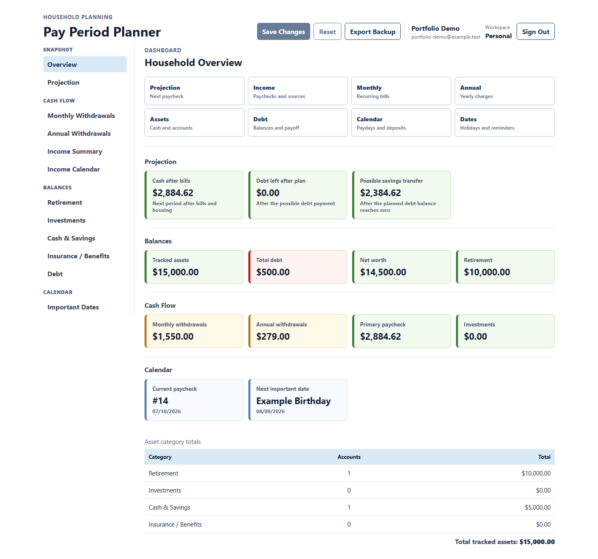

# Pay Period Planner

[](https://github.com/everdein/pay-period-planner/actions/workflows/ci.yml)
[](https://github.com/everdein/pay-period-planner/actions/workflows/codeql.yml)

Pay Period Planner is an authenticated household cash-flow workspace for
turning income, recurring bills, savings, debt, and important dates into a
clear plan for the next pay period. It is a full-stack portfolio application
built around a real planning problem rather than a generic technology demo.

The application is local-first today. A public demo is intentionally deferred
until hosting, privacy, backup, and reset policies are selected and verified.

## The Problem

Household finances rarely line up cleanly by calendar month. Paychecks arrive
on a cadence, bills land on different dates, annual expenses are easy to miss,
and a monthly total does not answer the immediate question: what can this
household safely plan for before the next paycheck?

Spreadsheets can solve pieces of that problem, but they make it difficult to
keep one current plan, detect stale saves, protect private data, or explain how
an estimate was derived.

## The Product

- One versioned workspace combines pay periods, income, bills, annual
  withdrawals, assets, debt, and important dates.
- A next-pay-period projection estimates bills, housing set-asides, possible
  debt payments, and possible savings transfers from configurable record roles.
- Draft edits remain local until one explicit save replaces the complete
  workspace; optimistic concurrency prevents silent stale overwrites.
- Signup, sign-in, server-managed sessions, CSRF protection, and
  database-derived workspace membership isolate each household's data.
- JSON backup and version-checked restore provide one application recovery
  format without treating exports as ordinary source files.

Pay Period Planner supports planning estimates and deliberate what-if
decisions. It is not accounting software, transaction reconciliation,
financial advice, or a connection to a bank or brokerage.

## Product Walkthrough



The [portfolio case study](docs/portfolio-case-study.md) continues through the
next-paycheck projection and mobile workflow, then connects those screens to a
concise architecture diagram and the JSON-to-PostgreSQL STAR story.

## Engineering Story

The project began with a file-backed JSON prototype and evolved into an
authenticated PostgreSQL application. The transition preserved the useful
single-workspace planning model while replacing global local state with:

- relational account and workspace ownership
- additive Flyway migrations
- version-checked aggregate replacement
- database-backed sessions and CSRF-protected writes
- relational audit history
- owner-approved retirement of obsolete prototype stores through Flyway

The result demonstrates how to move a working prototype toward scalable
boundaries without rewriting the product from scratch.

## Architecture

| Boundary              | Responsibility                                                                                                  |
| --------------------- | --------------------------------------------------------------------------------------------------------------- |
| React + Redux Toolkit | Account flow, workspace selection, canonical draft state, projections, and accessible responsive workflows      |
| Spring Boot API       | Session and CSRF enforcement, request validation, workspace-scoped query/command orchestration, and safe errors |
| PostgreSQL + Flyway   | Relational financial snapshots, account/workspace ownership, optimistic versions, and audit history             |
| GitHub Actions        | Type, lint, test, coverage, PostgreSQL, browser, accessibility, responsive, dependency, and security gates      |

The financial workspace is the sole public mutation aggregate. Controllers map
HTTP contracts, application services coordinate versioned reads and writes,
domain services normalize and calculate snapshots, and repositories own SQL.

Start with the [architecture map](docs/architecture-map.md),
[API contract](docs/api-contract.md), and
[architecture decision records](docs/adr/README.md) for the detailed boundaries
and their history.

## Deliberate Tradeoffs

- **Whole-workspace saves:** simpler household planning and consistent derived
  results in exchange for a larger replacement request and no granular
  collaborative editing.
- **Manual records:** transparent and demo-safe in exchange for no live account
  aggregation or transaction reconciliation.
- **PostgreSQL-only runtime:** one scalable persistence path in exchange for an
  explicit local database prerequisite.
- **Coarse audit events:** useful version and projection history without
  retaining sensitive field-level diffs.
- **Local-first delivery:** privacy and recovery decisions stay explicit, but
  reviewers must currently run the application rather than use a hosted demo.

Accepted boundaries and revisit triggers are maintained in the
[known limitations register](docs/known-limitations.md).

## Verified Behavior

The repository verifies more than compilation. Local and hosted gates exercise
frontend state and calculations, backend contracts and services, isolated
PostgreSQL migrations and persistence, authenticated cross-user browser
workflows, keyboard and automated WCAG behavior, responsive layouts,
dependency risk, and static analysis.

The current counts, aggregate coverage, security results, and qualifications
are published in the
[engineering evidence report](docs/engineering-evidence.md). The
[verification matrix](docs/verification-matrix.md) owns the commands and rules
for reproducing that evidence.

## Technology

| Area     | Stack                                                                          |
| -------- | ------------------------------------------------------------------------------ |
| Frontend | React 19, TypeScript, Redux Toolkit, Vite, Vitest, Testing Library, Playwright |
| Backend  | Java 21, Spring Boot 4, Spring JDBC, Maven, JaCoCo                             |
| Data     | PostgreSQL, Flyway, relational workspace snapshots and audit history           |
| Quality  | ESLint, Prettier, CSpell, axe, Snyk, CodeQL, Dependency Review                 |
| Delivery | PowerShell workflows and GitHub Actions                                        |

## Quick Start

The repository includes Windows PowerShell workflows for local setup. Install
Git, a Java JDK with `JAVA_HOME`, Node.js/npm, and PostgreSQL first; the
environment checker reports the versions it finds.

```powershell
git clone https://github.com/everdein/pay-period-planner.git
cd pay-period-planner
.\scripts\bootstrap-local.ps1 -IncludePostgres
```

The PostgreSQL setup is explicit and may require local administrator
credentials. It delegates all versioned schema work to Flyway and never seeds a
personal financial snapshot.

Start the backend and frontend in separate terminals:

```powershell
.\scripts\start-backend.ps1
```

```powershell
npm --prefix frontend run dev
```

Open [http://localhost:3000](http://localhost:3000), create an account, and
initialize the empty personal workspace. Detailed database setup and backend
configuration live in [backend/README.md](backend/README.md); frontend commands
and browser-test setup live in [frontend/README.md](frontend/README.md).

## Verification

Set the documented local application-role database variables, then run the
completion gate:

```powershell
.\scripts\verify-local.ps1
```

Additional live or credentialed gates are intentionally separate:

```powershell
.\scripts\run-browser-checks.ps1
.\scripts\run-security-checks.ps1
.\scripts\capture-portfolio-evidence.ps1
```

The browser and portfolio wrappers use synthetic data and remove their isolated
PostgreSQL schemas after each run. The security command requires network access,
the pinned Snyk CLI, and `SNYK_TOKEN`; missing authentication is not a pass.

## Repository Map

```text
pay-period-planner/
|-- backend/                 Spring Boot API, domain, persistence, migrations
|-- frontend/                React application, state, tests, browser workflows
|-- docs/                    Architecture, evidence, decisions, and runbooks
|-- scripts/                 Repeatable setup, inspection, and verification
|-- .github/workflows/       Hosted CI, security, and maintenance automation
|-- .agents/ and .codex/     Repository-scoped AI guidance and review agents
`-- AGENTS.md                Repository rules and data-safety policy
```

Use the [documentation index](docs/README.md) for the canonical reading order,
document ownership, operational references, and the deny-by-default public
corpus used by future portfolio search or chatbot tooling.

## Data Safety

Only `backend/data/financials.example.json` is intended for source control,
screenshots, and shared demonstrations. Local JSON, PostgreSQL contents,
exports, logs, traces, and screenshots may contain personal financial data.
Never commit or send those artifacts to external services.

## Current Boundaries

- PostgreSQL relational workspaces are the only persistence path; V10/V11
  retire the old JSONB store, transition administration, and unowned rows.
- Browser account sessions and relational workspace ownership are implemented;
  membership-management and collaboration UX are not.
- Full-snapshot saves use optimistic concurrency; the product does not provide
  granular collaborative editing.
- Deployment is a manual placeholder. Managed hosting, backups, telemetry,
  privacy policy, and demo reset remain future work.
- External financial data integrations are intentionally out of scope.

The [production-readiness roadmap](docs/production-readiness-roadmap.md) records
completed foundations and the remaining deployment and portfolio work without
describing the current local-first application as production-ready.
