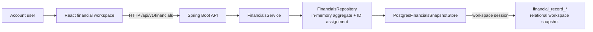
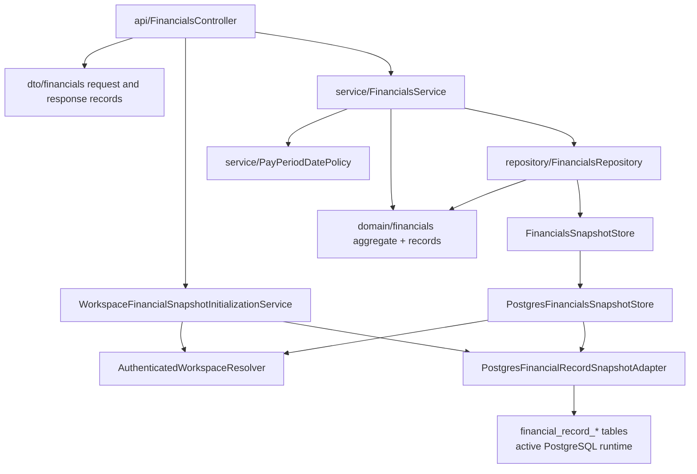
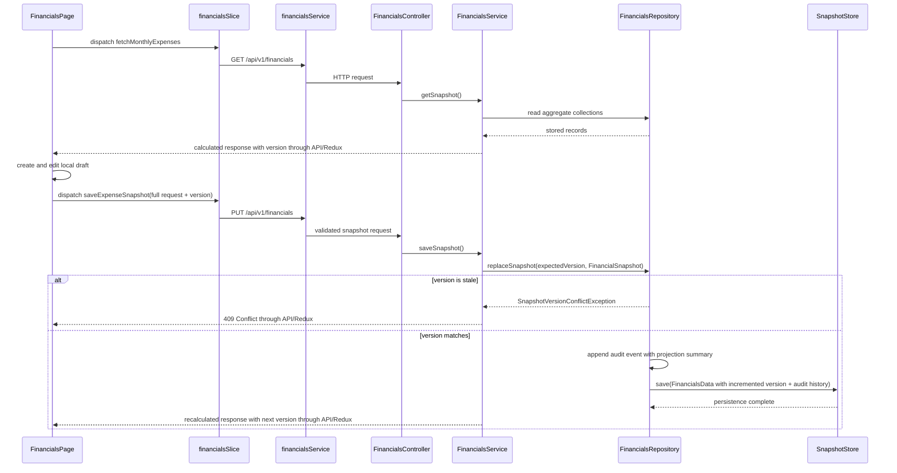
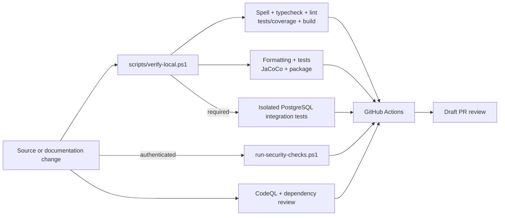

# Architecture Map

## System Context

The application is a financial planning workspace. The browser
loads one aggregate snapshot, edits a local draft, and saves the complete
snapshot through a Spring Boot API. The backend always uses workspace-scoped
relational PostgreSQL.
Persisted writes append coarse audit events with version movement and aggregate
projection summaries.

This map describes the current runtime. ADR 0014 records the implemented
PostgreSQL-only, workspace-scoped relational persistence and account/session
model.

The account API creates users, personal workspaces,
memberships, and hashed server sessions with explicit CSRF protection.
`WORKSPACE` principals resolve one current membership and every financial read
or write is isolated to that relational workspace. The React client recovers
the `HttpOnly` session, obtains fresh CSRF proof before each mutation, stores
only a non-sensitive workspace preference, and clears Redux snapshot state at
every account or workspace boundary. A separate Basic-auth operator workflow can
back up JSON/JSONB, import it into an empty owned relational workspace, verify
metadata, and roll back an unchanged migration. Full-snapshot saves use
optimistic versions; PostgreSQL writers serialize on a workspace row before
replacing its active snapshot.

## Frontend

| Area                                                  | Ownership                                                                  |
| ----------------------------------------------------- | -------------------------------------------------------------------------- |
| `frontend/src/App.tsx`                                | Application shell                                                          |
| `frontend/src/app/`                                   | Redux store and typed hooks                                                |
| `frontend/src/api/auth.ts`                            | Account session activation and workspace preference                        |
| `frontend/src/api/client.ts`                          | Cookie/CSRF/workspace fetch wrapper and HTTP error handling                |
| `frontend/src/api/endpoints/financials.ts`            | API contract types and endpoint calls                                      |
| `frontend/src/observability/`                         | Error containment, safe local reporting, recovery UI                       |
| `frontend/src/features/financials/FinancialsPage.tsx` | Authenticated load, save, export, and status shell                         |
| `WorkspaceOnboarding.tsx`                             | Empty-workspace pay-period setup and snapshot initialization               |
| `useFinancialsDraftWorkspace.ts`                      | Cross-domain draft lifecycle, projection, removal, and save composition    |
| `FinancialsNavigation.tsx`                            | Financial workspace navigation                                             |
| `FinancialsTabContent.tsx`                            | Active-tab presentation routing                                            |
| `frontend/src/features/financials/*Tab.tsx`           | Tab-level presentation and interactions                                    |
| `useMonthlyWithdrawalsDraft.ts`                       | Monthly bill form state, draft actions, sorting, and totals                |
| `useAnnualWithdrawalsDraft.ts`                        | Annual withdrawal form state, draft actions, sorting, and totals           |
| `useAssetAccountsDraft.ts`                            | Asset account forms, draft actions, category totals, and anchors           |
| `useDebtAccountsDraft.ts`                             | Debt account form state, draft actions, sorting, and totals                |
| `useIncomeSummaryDraft.ts`                            | Income source forms, anchors, and derived income summaries                 |
| `useIncomeCalendarDraft.ts`                           | Income-event editing, recurring payday generation, counts, and statuses    |
| `useImportantDatesDraft.ts`                           | Important-date forms, draft actions, sorting, and statuses                 |
| `financialsDraft.ts`                                  | Draft conversion, normalization, and request building                      |
| `financialsProjection.ts`                             | Projection calculations                                                    |
| `financialsDatePolicy.ts`                             | Client-side date policy                                                    |
| `financialsSlice.ts`                                  | Server snapshot, missing-state initialization, loading, saving, and errors |

The Redux slice owns the last server snapshot and request status. Its fetch
thunk suppresses concurrent loads so React Strict Mode effect replays cannot
deliver a late duplicate snapshot over an active local draft.
`useFinancialsDraftWorkspace` expands that snapshot into feature-owned draft
collections, coordinates their shared dirty/reset lifecycle, composes
cross-domain projection inputs, routes removal confirmations, and builds the
full save request. Feature-owned draft hooks manage each editor and its derived
domain state. `FinancialsPage` keeps the authenticated server-action boundary;
navigation and active-tab rendering stay in focused presentation components.
Unsaved edits stay in the browser until `buildExpenseSnapshotRequest` produces
the full `PUT /api/v1/financials` payload, including the snapshot `version`
last returned by the backend. A successful save replaces the Redux snapshot
with the server response; a failed save preserves the draft and surfaces the
error.

Local development uses Vite on port `3000`; `/api` is proxied to the backend on
port `8080`.

## Backend

| Layer                                          | Responsibilities                                                                               | Must not own                          |
| ---------------------------------------------- | ---------------------------------------------------------------------------------------------- | ------------------------------------- |
| `api/`                                         | Routes, validation entry points, HTTP status mapping                                           | Persistence or financial calculations |
| `dto/financials/`                              | External request/response contract                                                             | Storage implementation                |
| `domain/financials/`                           | Backend financial record types, saved snapshot aggregate, audit/projection types               | HTTP or storage implementation        |
| `service/`                                     | Validation, date policy, totals, normalization, orchestration                                  | File or SQL access                    |
| `repository/FinancialsRepository`              | In-memory aggregate, IDs, audit event capture, synchronized mutation, persistence              | HTTP behavior                         |
| `repository/*SnapshotStore`                    | Workspace-scoped relational snapshot load/save                                                 | API response derivation               |
| `PostgresFinancialRecordSnapshotAdapter`       | Workspace-scoped relational load, optimistic replacement, audit persistence, and granular CRUD | HTTP authorization                    |
| `AuthenticatedWorkspaceResolver`               | Resolve sole or `X-Workspace-ID` membership from the authenticated session                     | SQL or financial calculations         |
| `PostgresAccountSessionRepository`             | PostgreSQL users, memberships, hashed sessions, revocation, and recovery                       | Financial snapshot access             |
| `AccountSessionService`                        | Credential hashing, opaque-token issuance, account/workspace transaction                       | Financial persistence                 |
| `WorkspaceSnapshotMigrationService`            | Backed-up source validation, ownership checks, metadata verification, rollback                 | Runtime-store selection               |
| `PostgresWorkspaceSnapshotMigrationRepository` | Legacy JSONB reads, relational audit/history metadata, migration records                       | HTTP or frontend behavior             |
| `config/`                                      | Security, CORS, request limits, and observability configuration                                | Domain behavior                       |

`config/RequestObservabilityFilter` validates or creates request IDs, records
safe request completion metadata, and increments low-cardinality snapshot
outcome counters. Spring Boot supplies standard HTTP/JVM metrics. Metrics are
credential-protected; only health and info remain public. The production
profile emits Logstash-compatible JSON, while local startup retains readable
console output.

The granular record and pay-period routes use the same repository aggregate as
the full snapshot route. The current UI uses the full snapshot as its primary
save boundary.

## Persistence

| Concern            | Runtime behavior                                                       |
| ------------------ | ---------------------------------------------------------------------- |
| Adapter            | `PostgresFinancialsSnapshotStore`                                      |
| Active data        | Workspace-scoped `financial_record_*` rows and relational audit events |
| Initial data       | Explicit migration or application-created snapshot; no implicit seed   |
| Authorization      | Account session `WORKSPACE` authority plus membership selection        |
| Schema             | Flyway migrations under `db/migration/`                                |
| Local verification | Required isolated-schema integration gate                              |

Flyway is the only PostgreSQL migration executor. Local setup delegates to
`scripts/migrate-postgres.ps1`, application startup uses Spring Flyway
integration, and PostgreSQL integration tests use the Flyway Java API against
isolated schemas. Direct execution of versioned SQL files is unsupported.

`V1__create_financials_schema.sql` defines normalized tables that remain
inactive historical groundwork. ADR 0009 decides they should not become the
active relational persistence path as-is, and they may remain empty.
`V2__create_financial_snapshot_document.sql` defines the retained legacy JSONB
migration source. `V3__create_financial_record_snapshot_schema.sql` defines the
`financial_record_*` relational table family from ADR 0010, and
`V4__add_financial_record_app_id_constraints.sql` adds the app-record
uniqueness needed by the granular CRUD adapter from ADR 0011. The PostgreSQL
runtime is wired to this relational adapter.
`V5__create_identity_workspace_session_schema.sql` adds users, workspaces,
memberships, and hashed server-session storage. The PostgreSQL account API uses
those tables for signup, sign-in, recovery, and sign-out. Current financial API
authentication derives from account sessions and current memberships. Legacy
Basic credentials remain for operator endpoints and metrics, not PostgreSQL
financial access.
`V6__scope_financial_record_snapshots_to_workspace.sql` replaces the global
relational active-snapshot constraint with one active snapshot per workspace
and requires a workspace ID for every new relational snapshot. Every adapter
operation is workspace-scoped. Pre-V6 unowned relational rows remain untouched
until explicit migration; the JSONB document is not a runtime write target.
`V7__add_workspace_snapshot_migration_history.sql` preserves storage-envelope
audit events beside relational snapshots and records source fingerprints,
destination ownership, versions, counts, status, and timestamps for explicit
JSON/JSONB migration and guarded rollback. The operator service refuses to
overwrite an active workspace snapshot and leaves both the legacy source and
external backup untouched.
At runtime, the request-scoped aggregate repository loads one selected
workspace, appends audit metadata in memory, and saves through an optimistic
relational replacement. Historical snapshots and audit events remain retained.
The application role is write-capable; inspection integrations should use a
separate read-only role.

## Snapshot Request Flow

Derived totals are returned by the backend and are not accepted as persisted
request fields. Some frontend summary and projection values are also derived
for presentation. Contract changes must be traced across frontend types,
request construction, backend DTOs, service mapping, both stores, and tests.

CSV and XLSX import/export are API-boundary codecs around the same source
snapshot shape. `FinancialSnapshotTabularCodec` converts between the
full-snapshot request DTO and a fixed-column tabular format; imports still call
the version-checked full-snapshot save path and do not introduce a separate
storage model.

## Verification and Delivery

GitHub Actions repeats frontend quality gates, frontend and backend builds,
coverage, the required PostgreSQL integration profile against an ephemeral
service, and an authenticated high-severity Snyk scan. Separate hosted
workflows run CodeQL for Java and JavaScript/TypeScript and review pull-request
dependency changes for newly introduced high- or critical-severity
vulnerabilities. The deploy job is a manual placeholder, not production
infrastructure.

## Data Boundaries

- `financials.example.json` is synthetic and shareable.
- `financials.local.json`, PostgreSQL rows, exports, audit history, logs, and
  screenshots may contain personal financial data.
- Investigation should prefer schemas, keys, counts, versions, and timestamps.
- Personal values must not enter commits, test fixtures, documentation, PR
  descriptions, CI artifacts, or external tools.
- Setup and migrations mutate database state; inspection must be read-only.

## Change Routing

| Change                           | Start here                                 | Also inspect                                                     |
| -------------------------------- | ------------------------------------------ | ---------------------------------------------------------------- |
| UI interaction or draft behavior | `frontend/src/features/financials/`        | Slice, API types, accessibility, tests                           |
| HTTP contract                    | Controller and DTOs                        | Frontend endpoint types, service, contract tests, docs           |
| CSV/XLSX import/export           | `FinancialSnapshotTabularCodec`            | Controller/service tests, API docs, data-safety rules            |
| Financial/date rule              | Backend service or focused frontend helper | Both presentation and persistence assumptions                    |
| Legacy JSON migration            | Workspace migration service and scripts    | Backup verification, isolated integration test, storage docs     |
| PostgreSQL behavior              | Store plus additive migration              | Session boundary, isolated integration test, storage docs        |
| Audit/history behavior           | `FinancialsRepository` and audit DTOs      | API docs, storage guide, data-safety rules                       |
| CI/security                      | `.github/workflows/*.yml`                  | Local scripts, lock files, permissions, hosted scan expectations |
| Architecture decision            | Owning code plus new ADR                   | Architecture map, limitations, affected READMEs                  |

## Authoritative References

- Repository-wide rules: `AGENTS.md`
- Domain terminology: `docs/domain-glossary.md`
- HTTP contract: `docs/api-contract.md`
- Database ownership and storage: `docs/database-storage-guide.md`
- Change verification: `docs/verification-matrix.md`
- Accepted gaps and revisit triggers: `docs/known-limitations.md`
- Symptom-driven diagnosis: `docs/troubleshooting-decision-tree.md`
- Logs, metrics, and request correlation: `docs/observability-guide.md`
- External connector and MCP boundaries: `docs/mcp-integration-guide.md`
- GitHub and Codex settings: `docs/github-codex-configuration.md`
- API and backend operations: `backend/README.md`
- Frontend development: `frontend/README.md`
- Architectural decisions: `docs/adr/`
- Repeatable local operations: `scripts/`
- Hosted checks: `.github/workflows/ci.yml`
