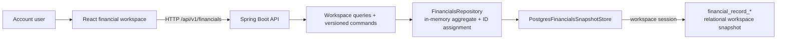
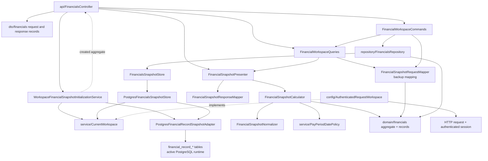
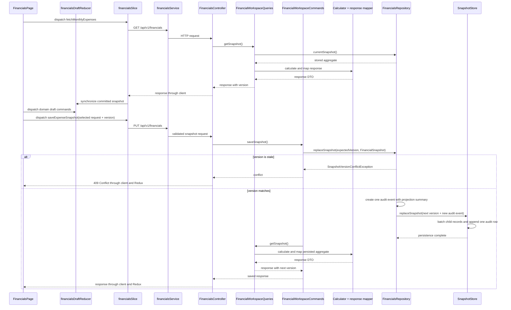
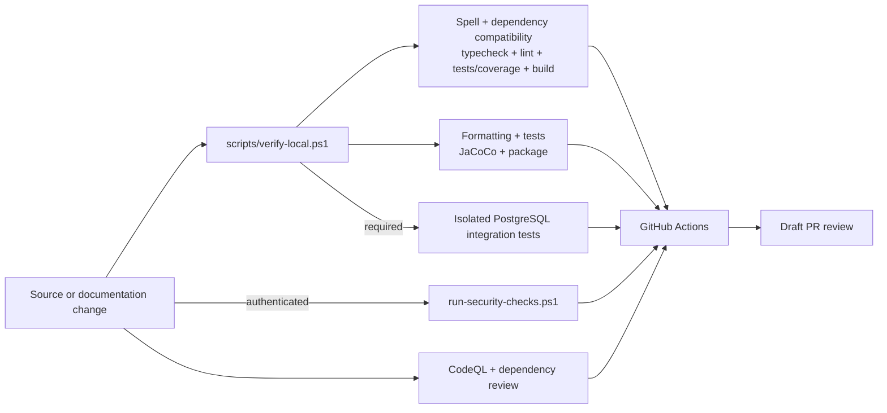

# Architecture Map

## System Context

The application is a financial planning workspace. The browser
loads one aggregate snapshot, edits a local draft, and saves the complete
snapshot through a Spring Boot API. The backend always uses workspace-scoped
relational PostgreSQL.
Persisted writes append coarse audit events with version movement and aggregate
projection summaries.

This map describes the current runtime. ADR 0014 records the implemented
PostgreSQL-only, workspace-scoped relational persistence and account/session
model.

The account API creates users, personal workspaces,
memberships, and hashed server sessions with explicit CSRF protection.
`WORKSPACE` principals resolve one current membership and every financial read
or write is isolated to that relational workspace. The React client recovers
the `HttpOnly` session, obtains fresh CSRF proof before each mutation, stores
only a non-sensitive workspace preference, and clears Redux snapshot state at
every account or workspace boundary. Basic authentication protects metrics
only; the retired admin namespace is denied. Full-snapshot saves use optimistic
versions, and PostgreSQL writers serialize on a workspace row before replacing
its active snapshot.

## Frontend

| Area                                                  | Ownership                                                                  |
| ----------------------------------------------------- | -------------------------------------------------------------------------- |
| `frontend/src/App.tsx`                                | Application shell                                                          |
| `frontend/src/app/`                                   | Redux store and typed hooks                                                |
| `frontend/src/api/auth.ts`                            | Account session activation and workspace preference                        |
| `frontend/src/api/client.ts`                          | Cookie/CSRF/workspace fetch wrapper and HTTP error handling                |
| `frontend/src/api/endpoints/financials.ts`            | API contract types and endpoint calls                                      |
| `frontend/src/observability/`                         | Error containment, safe local reporting, recovery UI                       |
| `frontend/src/features/financials/FinancialsPage.tsx` | Authenticated header and server-action controller                          |
| `FinancialsWorkspaceState.tsx`                        | Onboarding, loading, failure, retry, and loaded-workspace routing          |
| `FinancialsWorkflowFeedback.tsx`                      | Ready, dirty, save, conflict, and export feedback with recovery actions    |
| `WorkspaceOnboarding.tsx`                             | Empty-workspace pay-period setup and snapshot initialization               |
| `financialsDraftReducer.ts`                           | Canonical baseline, draft, roles, revisions, temporary IDs, and commands   |
| `useFinancialsDraftWorkspace.ts`                      | Reducer synchronization, domain facades, projection, and save composition  |
| `FinancialsNavigation.tsx`                            | Financial workspace navigation                                             |
| `FinancialsTabContent.tsx`                            | Active-tab presentation routing                                            |
| `frontend/src/features/financials/*Tab.tsx`           | Tab-level presentation and interactions                                    |
| `use*Draft.ts` domain hooks                           | Transient forms plus canonical draft selectors and reducer commands        |
| `financialsDraft.ts`                                  | Draft conversion, normalization, and request building                      |
| `financialsProjection.ts`                             | Projection calculations                                                    |
| `financialsDatePolicy.ts`                             | Client-side date policy                                                    |
| `financialsSlice.ts`                                  | Server snapshot, missing-state initialization, loading, saving, and errors |

The Redux slice owns the last server snapshot and request status. Its fetch
thunk suppresses concurrent loads so React Strict Mode effect replays cannot
deliver a late duplicate snapshot over an active local draft.
The feature-local financial draft reducer synchronizes that snapshot into one
committed baseline and one editable aggregate. It owns the snapshot version,
monotonic local revision, shared temporary-ID sequence, pending removal, reset
generation, record commands, and derived save/dirty selectors.
`useFinancialsDraftWorkspace` composes the reducer with domain-focused hooks,
cross-domain projections, and the full save request. The hooks keep only
transient form and editing state while dispatching canonical draft commands.
`FinancialsPage` keeps the authenticated server-action boundary and delegates
onboarding/loading/failure routing to `FinancialsWorkspaceState` and workflow
notices to `FinancialsWorkflowFeedback`. Navigation and active-tab rendering
stay in focused presentation components.
Unsaved edits stay in the browser until `buildExpenseSnapshotRequest` produces
the full `PUT /api/v1/financials` payload, including the snapshot `version`
last returned by the backend. A successful save replaces the Redux snapshot
with the server response; a failed save preserves the draft and surfaces the
error. `ApiError` keeps Problem Detail text, status, title, and request identity
separate. The financial slice classifies failures only from structured status,
and presentation components render the request reference from its dedicated
field.
Projection inputs are versioned role IDs in the canonical draft. The projection
settings UI dispatches role changes through the reducer; calculations and
removal protection resolve records by ID, never by mutable display labels.

Local development uses Vite on port `3000`; `/api` is proxied to the backend on
port `8080`.

## Backend

| Layer                                    | Responsibilities                                                                            | Must not own                          |
| ---------------------------------------- | ------------------------------------------------------------------------------------------- | ------------------------------------- |
| `api/`                                   | Routes, validation entry points, HTTP status mapping                                        | Persistence or financial calculations |
| `dto/financials/`                        | External request/response contract                                                          | Storage implementation                |
| `domain/financials/`                     | Backend financial record types, saved snapshot aggregate, audit/projection types            | HTTP or storage implementation        |
| `service/FinancialWorkspaceQueries`      | Current snapshot, audit-history, and JSON-backup query contract                             | Versioned writes                      |
| `service/FinancialWorkspaceCommands`     | Versioned aggregate replacement and JSON restore contract                                   | Financial presentation calculations   |
| `service/FinancialSnapshotPresenter`     | Calculate and map a supplied aggregate to the financial API response                        | Persistence reads or writes           |
| `service/FinancialSnapshot*`             | Request conversion, normalization, calculations, and API response construction              | HTTP status mapping or SQL access     |
| `service/CurrentWorkspace`               | Supply the required current workspace ID through a framework-neutral port                   | Headers, servlet requests, or SQL     |
| `repository/FinancialsRepository`        | In-memory aggregate, ID assignment, audit event capture, versioned replacement, persistence | HTTP behavior                         |
| `repository/*SnapshotStore`              | Workspace-scoped relational snapshot load/save                                              | API response derivation               |
| `PostgresFinancialRecordSnapshotAdapter` | Workspace-scoped relational load, optimistic replacement, and audit persistence             | HTTP authorization                    |
| `config/AuthenticatedRequestWorkspace`   | Resolve sole or `X-Workspace-ID` membership from the authenticated session                  | SQL or financial calculations         |
| `PostgresAccountSessionRepository`       | PostgreSQL users, memberships, hashed sessions, revocation, and recovery                    | Financial snapshot access             |
| `AccountSessionService`                  | Credential hashing, opaque-token issuance, account/workspace transaction                    | Financial persistence                 |
| `config/`                                | Security, CORS, request limits, and observability configuration                             | Domain behavior                       |

`config/RequestObservabilityFilter` validates or creates request IDs, records
safe request completion metadata, and increments low-cardinality snapshot
outcome counters. Spring Boot supplies standard HTTP/JVM metrics. Metrics are
credential-protected; only health and info remain public. The production
profile emits Logstash-compatible JSON, while local startup retains readable
console output.

The full snapshot route is the sole financial mutation boundary. Record edits
and pay-period changes remain local draft operations until one version-checked
aggregate save persists them.

## Persistence

| Concern            | Runtime behavior                                                       |
| ------------------ | ---------------------------------------------------------------------- |
| Adapter            | `PostgresFinancialsSnapshotStore`                                      |
| Active data        | Workspace-scoped `financial_record_*` rows and relational audit events |
| Initial data       | Application-created empty snapshot; no implicit seed                   |
| Authorization      | Account session `WORKSPACE` authority plus membership selection        |
| Schema             | Flyway migrations under `db/migration/`                                |
| Local verification | Required isolated-schema integration gate                              |

Flyway is the only PostgreSQL migration executor. Local setup delegates to
`scripts/migrate-postgres.ps1`, application startup uses Spring Flyway
integration, and PostgreSQL integration tests use the Flyway Java API against
isolated schemas. Direct execution of versioned SQL files is unsupported.

`V1__create_financials_schema.sql` historically defined normalized tables that
never became the runtime persistence path. ADR 0029 and V12 remove those
look-alike objects after the owner waived recovery from obsolete stores; V1
remains immutable migration history.
`V2__create_financial_snapshot_document.sql` historically introduced the JSONB
store retired by V10. `V3__create_financial_record_snapshot_schema.sql` defines the
`financial_record_*` relational table family from ADR 0010, and
`V4__add_financial_record_app_id_constraints.sql` preserves stable app-record
identity within each snapshot. The CRUD methods introduced with ADR 0011 were
later retired by ADR 0016; the additive constraints and migration history
remain valid. The PostgreSQL runtime is wired to this relational adapter.
`V5__create_identity_workspace_session_schema.sql` adds users, workspaces,
memberships, and hashed server-session storage. The PostgreSQL account API uses
those tables for signup, sign-in, recovery, and sign-out. Current financial API
authentication derives from account sessions and current memberships. Basic
credentials remain for protected metrics, not PostgreSQL financial access.
`V6__scope_financial_record_snapshots_to_workspace.sql` replaces the global
relational active-snapshot constraint with one active snapshot per workspace
and requires a workspace ID for every new relational snapshot. Every adapter
operation is workspace-scoped. V7 adds relational audit-event persistence and
historically added a transition ledger.
`V8__add_financial_projection_roles.sql` stores three typed projection role
references per versioned snapshot and backfills exact historical anchor labels.
The adapter reads and writes these rows with the aggregate. Service validation
ensures each role references one record in its expected collection.
`V9__add_financial_planning_settings.sql` stores the workspace pay cadence and
IANA planning time zone on every versioned snapshot. Historical and legacy
input defaults to `BIWEEKLY` and `UTC`. The calculator derives one
zone-specific `currentDate` per response and uses it for active-period
selection; the frontend uses cadence-aware annualization and recurring-payday
rules while keeping persisted dates date-only.
`V10__retire_legacy_snapshot_migration.sql` removes the V2 JSONB table, V7
transition ledger, and source-document linkage.
`V11__require_workspace_owned_financial_snapshots.sql` removes unowned
compatibility rows, makes `financial_record_snapshot.workspace_id` non-null,
and leaves the workspace-scoped relational aggregate as the sole persistence
path.
`V12__retire_inactive_v1_financial_schema.sql` drops the eight unused V1 tables
without changing workspace-owned runtime records or retained version history.
At runtime, the query service asks the request-scoped aggregate repository for
one complete current snapshot. The repository lazily loads it for the selected
workspace, and calculation/response collaborators derive the API response from
that aggregate. Audit-history requests use a separate,
newest-first SQL query with a database-enforced limit and do not hydrate the
current aggregate. An optimistic replacement passes exactly one new audit event
to the store; the adapter writes each child-record family in JDBC batches and
appends that event in the same workspace-locked transaction. Historical
snapshots and audit events remain retained.
The active store and initialization service obtain the selected workspace ID
through `CurrentWorkspace`. Only `AuthenticatedRequestWorkspace` reads the HTTP
header and Spring Security principal. Financial application exceptions are
mapped to status-bearing Problem Details only by `ApiExceptionHandler`.
Initialization returns its successfully created domain aggregate to the
controller, which passes it to `FinancialSnapshotPresenter`; it does not issue
a current-snapshot query after the write. Ordinary reads use the same presenter.
The application role is write-capable; inspection integrations should use a
separate read-only role.

## Snapshot Request Flow

Derived totals and `currentDate` are returned by the backend and are not
accepted as persisted request fields. Planning settings are stored source
fields. Some frontend summary and projection values are also derived for
presentation. Contract changes must be traced across frontend types,
request construction, backend DTOs, request/response mappers, both stores, and tests.

JSON backup and restore share the `FinancialSnapshotBackup` envelope. Export
records the source version and timestamp; restore accepts that envelope
unchanged while taking the target workspace's current `expectedVersion`
separately. Restore then delegates to the same aggregate validation and
optimistic replacement path as a full-snapshot save. It does not introduce a
separate storage model or preserve complete relational audit history.

## Verification and Delivery

GitHub Actions repeats frontend dependency compatibility and quality gates,
frontend and backend builds, coverage, the required PostgreSQL integration
profile against an ephemeral
service, and an authenticated high-severity Snyk scan. Separate hosted
workflows run CodeQL for Java and JavaScript/TypeScript and review pull-request
dependency changes for newly introduced high- or critical-severity
vulnerabilities. The deploy job is a manual placeholder, not production
infrastructure.

## Data Boundaries

- `financials.example.json` is synthetic and shareable.
- `financials.local.json`, PostgreSQL rows, exports, audit history, logs, and
  screenshots may contain personal financial data.
- Investigation should prefer schemas, keys, counts, versions, and timestamps.
- Personal values must not enter commits, test fixtures, documentation, PR
  descriptions, CI artifacts, or external tools.
- Setup and migrations mutate database state; inspection must be read-only.

## Change Routing

| Change                           | Start here                                    | Also inspect                                                     |
| -------------------------------- | --------------------------------------------- | ---------------------------------------------------------------- |
| UI interaction or draft behavior | `frontend/src/features/financials/`           | Slice, API types, accessibility, tests                           |
| HTTP contract                    | Controller and DTOs                           | Frontend endpoint types, mappers, contract tests, docs           |
| JSON backup and restore          | Controller, workspace operations, backup DTO  | Scripts, contract tests, API docs, data-safety rules             |
| Financial/date rule              | Backend calculator or focused frontend helper | Both presentation and persistence assumptions                    |
| PostgreSQL behavior              | Store plus additive migration                 | Session boundary, isolated integration test, storage docs        |
| Audit/history behavior           | Repository, store, relational adapter         | Audit DTOs, API docs, storage guide, data-safety rules           |
| CI/security                      | `.github/workflows/*.yml`                     | Local scripts, lock files, permissions, hosted scan expectations |
| Architecture decision            | Owning code plus new ADR                      | Architecture map, limitations, affected READMEs                  |

## Authoritative References

- Repository-wide rules: `AGENTS.md`
- Domain terminology: `docs/domain-glossary.md`
- HTTP contract: `docs/api-contract.md`
- Database ownership and storage: `docs/database-storage-guide.md`
- Change verification: `docs/verification-matrix.md`
- Accepted gaps and revisit triggers: `docs/known-limitations.md`
- Symptom-driven diagnosis: `docs/troubleshooting-decision-tree.md`
- Logs, metrics, and request correlation: `docs/observability-guide.md`
- External connector and MCP boundaries: `docs/mcp-integration-guide.md`
- GitHub and Codex settings: `docs/github-codex-configuration.md`
- API and backend operations: `backend/README.md`
- Frontend development: `frontend/README.md`
- Architectural decisions: `docs/adr/`
- Repeatable local operations: `scripts/`
- Hosted checks: `.github/workflows/ci.yml`
