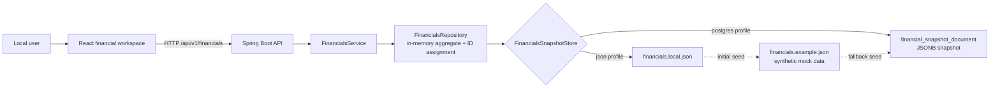
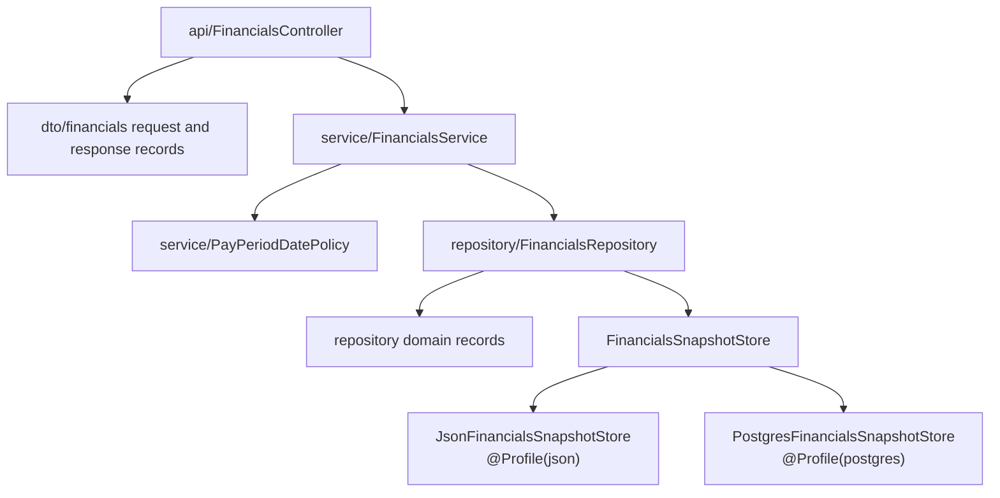
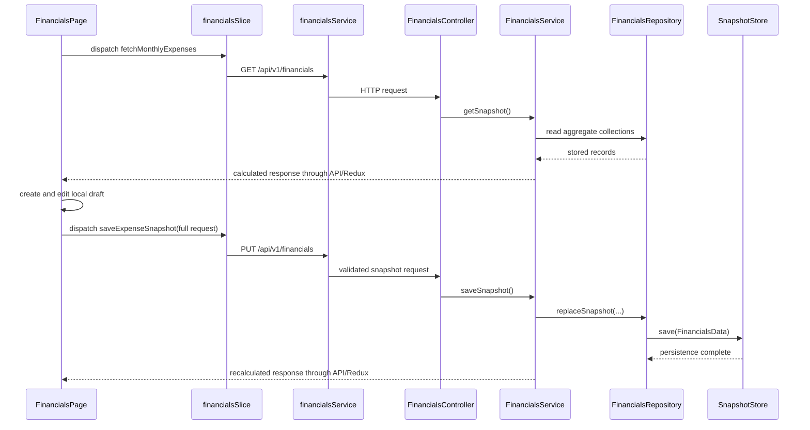
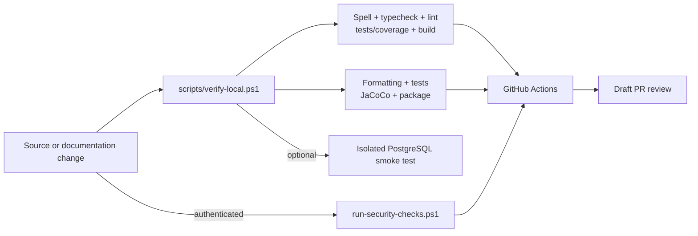

# Architecture Map

## System Context

The application is a single-user financial planning workspace. The browser
loads one aggregate snapshot, edits a local draft, and saves the complete
snapshot through a Spring Boot API. The backend selects one persistence adapter
at startup: local JSON by default or PostgreSQL under the `postgres` profile.

There is no authentication, multi-user isolation, production deployment, or
conflict detection. Saves are whole-snapshot, last-write-wins operations.

## Frontend

| Area                                                  | Ownership                                             |
| ----------------------------------------------------- | ----------------------------------------------------- |
| `frontend/src/App.tsx`                                | Application shell                                     |
| `frontend/src/app/`                                   | Redux store and typed hooks                           |
| `frontend/src/api/client.ts`                          | Fetch wrapper and HTTP error handling                 |
| `frontend/src/api/endpoints/financials.ts`            | API contract types and endpoint calls                 |
| `frontend/src/features/financials/FinancialsPage.tsx` | Workspace orchestration and local draft state         |
| `frontend/src/features/financials/*Tab.tsx`           | Tab-level presentation and interactions               |
| `financialsDraft.ts`                                  | Draft conversion, normalization, and request building |
| `financialsProjection.ts`                             | Projection calculations                               |
| `financialsDatePolicy.ts`                             | Client-side date policy                               |
| `financialsSlice.ts`                                  | Server snapshot, loading, saving, and error state     |

The Redux slice owns the last server snapshot and request status.
`FinancialsPage` expands that snapshot into component-local draft collections.
Unsaved edits stay in the browser until `buildExpenseSnapshotRequest` produces
the full `PUT /api/v1/financials` payload. A successful save replaces the Redux
snapshot with the server response; a failed save preserves the draft and
surfaces the error.

Local development uses Vite on port `3000`; `/api` is proxied to the backend on
port `8080`.

## Backend

| Layer                             | Responsibilities                                                        | Must not own                          |
| --------------------------------- | ----------------------------------------------------------------------- | ------------------------------------- |
| `api/`                            | Routes, validation entry points, HTTP status mapping                    | Persistence or financial calculations |
| `dto/financials/`                 | External request/response contract                                      | Storage implementation                |
| `service/`                        | Validation, date policy, totals, normalization, orchestration           | File or SQL access                    |
| `repository/FinancialsRepository` | In-memory aggregate, IDs, synchronized mutation, persistence delegation | HTTP behavior                         |
| `repository/*SnapshotStore`       | Load/save serialization for one storage mode                            | API response derivation               |
| `config/`                         | Bound persistence configuration                                         | Domain behavior                       |

The granular bill and pay-period routes use the same repository aggregate as
the full snapshot route. The current UI uses the full snapshot as its primary
save boundary.

## Persistence Profiles

| Concern            | JSON profile                                        | PostgreSQL profile                                      |
| ------------------ | --------------------------------------------------- | ------------------------------------------------------- |
| Activation         | Default profile                                     | `SPRING_PROFILES_ACTIVE=postgres`                       |
| Adapter            | `JsonFinancialsSnapshotStore`                       | `PostgresFinancialsSnapshotStore`                       |
| Active data        | `backend/data/financials.local.json`                | `financial_snapshot_document.snapshot_json`             |
| Seed source        | `financials.example.json` when local file is absent | Local JSON, then example JSON when no active row exists |
| Schema             | None                                                | Flyway migrations under `db/migration/`                 |
| Local verification | Standard backend tests                              | Opt-in isolated-schema integration test                 |

`V1__create_financials_schema.sql` defines normalized tables as future
groundwork. They are not read or written by the active adapter and may remain
empty. `V2__create_financial_snapshot_document.sql` defines the active JSONB
document store. The application role is write-capable; inspection integrations
should use a separate read-only role.

## Snapshot Request Flow

Derived totals are returned by the backend and are not accepted as persisted
request fields. Some frontend summary and projection values are also derived
for presentation. Contract changes must be traced across frontend types,
request construction, backend DTOs, service mapping, both stores, and tests.

## Verification and Delivery

GitHub Actions repeats frontend quality gates, frontend and backend builds,
coverage, and an authenticated high-severity Snyk scan. The deploy job is a
manual placeholder, not production infrastructure.

## Data Boundaries

- `financials.example.json` is synthetic and shareable.
- `financials.local.json`, PostgreSQL rows, exports, logs, and screenshots may
  contain personal financial data.
- Investigation should prefer schemas, keys, counts, versions, and timestamps.
- Personal values must not enter commits, test fixtures, documentation, PR
  descriptions, CI artifacts, or external tools.
- Setup and migrations mutate database state; inspection must be read-only.

## Change Routing

| Change                           | Start here                                 | Also inspect                                              |
| -------------------------------- | ------------------------------------------ | --------------------------------------------------------- |
| UI interaction or draft behavior | `frontend/src/features/financials/`        | Slice, API types, accessibility, tests                    |
| HTTP contract                    | Controller and DTOs                        | Frontend endpoint types, service, contract tests, docs    |
| Financial/date rule              | Backend service or focused frontend helper | Both presentation and persistence assumptions             |
| JSON behavior                    | `JsonFinancialsSnapshotStore`              | PostgreSQL parity and seed policy                         |
| PostgreSQL behavior              | Store plus additive migration              | JSON parity, isolated integration test, storage docs      |
| CI/security                      | `.github/workflows/ci.yml`                 | Local scripts, lock files, permissions, Snyk expectations |
| Architecture decision            | Owning code plus new ADR                   | Architecture map, limitations, affected READMEs           |

## Authoritative References

- Repository-wide rules: `AGENTS.md`
- Domain terminology: `docs/domain-glossary.md`
- HTTP contract: `docs/api-contract.md`
- Database ownership and storage: `docs/database-storage-guide.md`
- Change verification: `docs/verification-matrix.md`
- Accepted gaps and revisit triggers: `docs/known-limitations.md`
- Symptom-driven diagnosis: `docs/troubleshooting-decision-tree.md`
- API and backend operations: `backend/README.md`
- Frontend development: `frontend/README.md`
- Architectural decisions: `docs/adr/`
- Repeatable local operations: `scripts/`
- Hosted checks: `.github/workflows/ci.yml`
