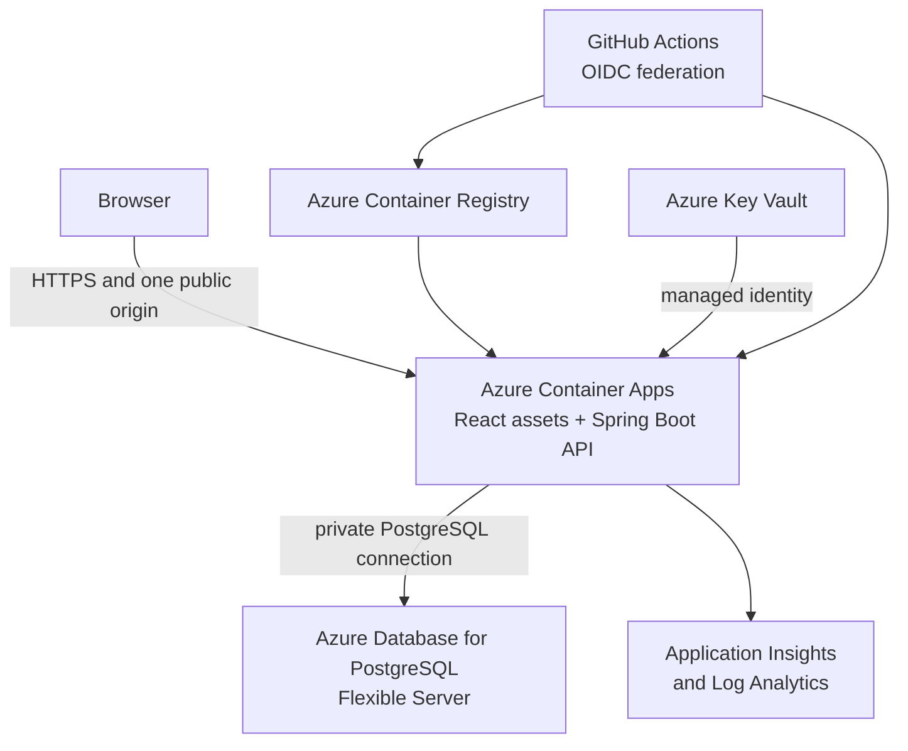

# Azure Migration Plan

Status: Deployment boundary approved; no Azure resources created

## Objective

Move Pay Period Planner from its local-first runtime to an access-controlled
Azure portfolio environment that uses synthetic data. Preserve the current
single-origin browser security model, PostgreSQL-only persistence, Flyway
migration authority, and repository verification gates.

ADR 0030 approves a production-shaped, single-owner learning environment. The
owner may create the first real account, but every financial value, backup,
restore artifact, log, and screenshot in Azure must remain synthetic. This plan
does not approve unrestricted public signup or hosting personal financial data.

## Confirmed Planning Decisions

- **Purpose:** production-grade Azure learning and portfolio evidence, not a
  supported public financial product.
- **Supported user:** one owner-operated account. Additional real users are out
  of scope.
- **Data:** synthetic financial values only. Local personal PostgreSQL data and
  application exports do not cross the cloud boundary.
- **Identity:** retain and harden the existing application-managed accounts,
  hashed passwords, opaque sessions, CSRF, and workspace authorization.
- **Registration:** production defaults to closed registration. A temporary,
  secret-protected owner-bootstrap mode creates exactly one first account and
  is then disabled.
- **Recovery:** operator-assisted account recovery for the single-owner phase;
  no email reset workflow or security questions.
- **Public exposure:** HTTPS may be public, but public registration is not.
  Synthetic data reduces privacy impact without removing abuse, availability,
  credential, or cost risk.
- **Delivery:** infrastructure as code, federated GitHub deployment identity,
  immutable images, controlled Flyway migrations, health gates, and rollback.
- **Operations:** private database access, managed secrets, sanitized telemetry,
  cost alerts, backup retention, and proved restore remain release gates.

The accepted rationale and tradeoffs are recorded in
[ADR 0030](adr/0030-use-a-production-shaped-single-owner-azure-environment.md).

## Target Boundary

The first release should use one containerized web application that packages
the compiled Vite frontend with the Spring Boot API. Keeping one public origin
preserves relative `/api/v1` requests, `HttpOnly` `SameSite=Strict` session
cookies, CSRF protection, and a narrow CORS policy. The backend filesystem can
remain ephemeral because PostgreSQL owns all durable runtime state.

Use Azure Front Door and a Web Application Firewall only when their edge
request limits, custom-domain routing, or public exposure controls justify the
additional cost and operational surface. They are not required to prove the
first access-controlled deployment.

## Azure Resources

The infrastructure-as-code definition should own:

- one resource group per environment in a selected Azure region;
- Azure Container Registry for immutable application images;
- an Azure Container Apps environment and application;
- Azure Database for PostgreSQL Flexible Server with private connectivity;
- virtual-network, subnet, private DNS, and role-assignment resources;
- Azure Key Vault and a workload managed identity;
- Application Insights and Log Analytics with explicit retention;
- cost tags, a budget alert, and environment-specific resource names.

Start the synthetic portfolio environment with one application replica and a
low-cost PostgreSQL SKU when the measured workload permits it. Do not enable
production high availability by assumption. Select General Purpose compute,
multiple application replicas, zone redundancy, geo-redundant recovery, or
Front Door only after availability objectives and budget justify them.

## Recommended Implementation Defaults

These are the starting defaults for implementation, not authorization to spend:

| Decision                | Recommended default                                                       | Reason                                                                         |
| ----------------------- | ------------------------------------------------------------------------- | ------------------------------------------------------------------------------ |
| Infrastructure language | Bicep                                                                     | Azure-native, reviewable, and sufficient for this single-cloud learning goal   |
| Environments            | `dev` first; add `portfolio` only after the deployment path is repeatable | Prevent an unproved environment from becoming the production path              |
| Region                  | East US 2, subject to subscription availability and a price check         | Close to the owner and commonly supports the planned services                  |
| Public origin           | Container Apps managed HTTPS domain initially                             | A custom domain should not block the first deployment                          |
| Application scale       | One replica with conservative CPU and memory                              | Appropriate for one supported user; measure before scaling                     |
| PostgreSQL              | Lowest suitable development SKU, private access, no HA initially          | Keep the learning environment affordable while retaining managed backups       |
| Backup retention        | 7 days initially, followed by a proved restore                            | Expand only when recovery objectives justify the storage cost                  |
| Log retention           | 30 days initially                                                         | Enough for learning and incident review without indefinite telemetry cost      |
| Edge service            | No Front Door initially                                                   | Add it when WAF, routing, custom-domain, or edge-limit requirements justify it |
| Secrets                 | Key Vault plus managed identity or Container Apps secret references       | Keep production values out of GitHub and infrastructure outputs                |
| Deployment identity     | GitHub OIDC federation scoped to the deployment environment               | Avoid a long-lived Azure client secret                                         |

Before provisioning, confirm actual regional service availability and obtain an
Azure pricing estimate for the selected SKUs. Resource names must include the
application, environment, region abbreviation, and a uniqueness suffix where
Azure requires global uniqueness. Use tags for `application`, `environment`,
`owner`, `data-classification=synthetic`, and `managed-by=bicep`.

## Owner Account Bootstrap

The current unrestricted `/api/v1/auth/signup` flow must not be exposed as the
production registration policy. Implement these states:

| Mode              | Behavior                                                                                                     |
| ----------------- | ------------------------------------------------------------------------------------------------------------ |
| `disabled`        | Reject signup without revealing account counts; this is the production default                               |
| `owner-bootstrap` | Permit one signup only when there are no users and the request proves possession of the bootstrap credential |
| `development`     | Preserve convenient local signup and existing automated tests                                                |

The empty-user check, user creation, personal workspace, membership, initial
snapshot, and session issuance must succeed atomically. Concurrent bootstrap
requests must produce one owner at most. Store only a verifier or use a
constant-time comparison for the temporary bootstrap credential; never log the
credential or return it in an error. Rate-limit bootstrap and sign-in attempts.

After the owner account is created:

1. verify sign-in, session recovery, CSRF writes, workspace isolation, sign-out,
   and session revocation;
2. remove or rotate the bootstrap credential;
3. redeploy with registration mode `disabled`;
4. verify signup is closed from the public origin; and
5. enter only an obvious synthetic workspace.

Account recovery remains an operator procedure. It must identify the one owner,
replace the password hash through an audited and narrowly scoped operation,
revoke every active session, and require a fresh sign-in. The recovery procedure
must be tested without exposing the replacement password in command output,
logs, shell history, or repository files.

## Threat and Cost Boundaries

The first release explicitly protects against the most relevant learning-stage
risks:

- unknown users claiming the first account or registering later;
- credential guessing, session theft, CSRF, and workspace authorization bypass;
- oversized or abusive requests consuming application or database resources;
- accidental public PostgreSQL exposure or overly broad database privileges;
- secrets appearing in source, workflow logs, application logs, or outputs;
- financial payloads entering telemetry, screenshots, backups, or test reports;
- migration failure, incompatible rollback, data corruption, and failed restore;
- runaway compute, telemetry, storage, or network cost; and
- stale public environments continuing to run without an operational owner.

Controls reduce these risks; they do not establish a production security claim.
Set at least two budget notifications below and at the approved monthly ceiling,
and document an emergency stop that disables ingress or scales the application
down without deleting the database impulsively.

## Provisioning Readiness Checklist

Complete or confirm these values before the first Azure write operation:

The interactive account, billing, workstation, provider, quota, and GitHub OIDC
steps are maintained in
[Azure Deployment Prerequisites](azure-prerequisites.md). Complete that checklist
without committing account identifiers or credentials.

- [ ] Azure tenant and subscription name; do not commit the subscription ID.
- [ ] Owner account has multi-factor authentication and only the Azure roles
      needed to provision the environment.
- [ ] Approved monthly ceiling and two earlier budget-notification thresholds.
- [ ] East US 2 service/SKU availability and a saved pricing estimate, or an
      explicitly selected alternate region.
- [ ] Globally unique naming suffix and the `dev` resource-group name.
- [ ] Bicep selected as infrastructure authority, with deployment parameters
      separated from secrets.
- [ ] GitHub environment name, required reviewer, and OIDC trust boundary.
- [ ] PostgreSQL administrator, migration-role, and runtime-role ownership plan.
- [ ] Owner-bootstrap credential generation, Key Vault storage, use, rotation,
      and removal procedure.
- [ ] Synthetic seed values and synthetic owner email convention.
- [ ] Backup redundancy, seven-day retention, and first restore-test target.
- [ ] Thirty-day telemetry retention, sanitization rules, and initial alerts.
- [ ] Emergency ingress-disable, scale-down, and full teardown procedures.

## First Implementation Sequence

Tomorrow's work should proceed in this order:

1. create a feature branch and ADR-aligned implementation checklist;
2. add and verify the single-origin, non-root application container locally;
3. add the closed-registration and transactional owner-bootstrap behavior with
   focused concurrency, authentication, and production-guard tests;
4. add Bicep modules and a non-secret development parameter file;
5. run a Bicep validation/preview before creating resources;
6. provision the development foundation with budget controls first;
7. deploy an empty database and application revision, then verify health;
8. create the owner account through bootstrap and immediately close signup;
9. run authenticated hosted checks using only synthetic data; and
10. configure telemetry, prove backup/restore and rollback, then decide whether
    the development environment is ready to become the portfolio boundary.

## Work Areas

### 1. Architecture and ownership

- [ ] Select the Azure subscription, region, naming convention, and resource
      ownership model.
- [ ] Confirm that the first environment is synthetic and access controlled.
- [ ] Define the acceptable recovery point, recovery time, availability, log
      retention, and monthly budget.
- [ ] Record the implemented Azure boundary in a new ADR before deployment.
- [ ] Define resource shutdown and deletion responsibilities.

Estimated effort: 1-2 engineering days.

### 2. Application container

- [ ] Add a multi-stage container build for the Vite frontend and Java 21
      Spring Boot backend.
- [ ] Package the compiled frontend with the backend so UI and API share one
      public origin.
- [ ] Run the final image as a non-root user with an ephemeral filesystem.
- [ ] Use `/actuator/health` for startup, readiness, and liveness checks.
- [ ] Verify secure cookies, forwarded HTTPS headers, static-route fallback,
      request identifiers, and maximum request size behind Azure ingress.

Estimated effort: 2-4 engineering days.

### 3. Infrastructure as code

- [ ] Select Bicep or Terraform and make it the provisioning authority.
- [ ] Define development and portfolio environments without copying secrets
      into source control or infrastructure outputs.
- [ ] Configure private database access and deny broad public database access.
- [ ] Configure managed identity and least-privilege Azure role assignments.
- [ ] Add cost tags, budget alerts, and a documented teardown command.

Estimated effort: 4-7 engineering days.

### 4. PostgreSQL and Flyway

- [ ] Create separate database identities for Flyway migrations and runtime
      queries and writes. The runtime role must not own the schema.
- [ ] Require encrypted PostgreSQL connections and use private DNS/networking.
- [ ] Keep Flyway as the only schema authority and validate the complete
      migration chain against an empty database.
- [ ] Validate each release against the previous released schema.
- [ ] Run migrations as a controlled deployment step or Container Apps job
      before shifting traffic, rather than relying on concurrent replicas.
- [ ] Preserve additive, backward-compatible migrations so the previous
      application revision remains a viable rollback target.

Estimated effort: 3-5 engineering days.

### 5. Secrets and configuration

- [ ] Store production-only values in Key Vault and expose them through managed
      identity or Container Apps secret references.
- [ ] Generate unique database and operator credentials; never reuse local
      defaults.
- [ ] Enable the Spring `prod` profile, secure session cookies, and an explicit
      allowed origin.
- [ ] Document secret rotation without printing credential values.

Estimated effort: 2-3 engineering days.

### 6. Delivery and rollback

- [ ] Extend GitHub Actions only after the target environment is approved.
- [ ] Authenticate to Azure with workload identity federation and GitHub OIDC,
      not a long-lived service-principal secret.
- [ ] Run the existing verification and security gates before building an
      immutable image.
- [ ] Scan, publish, and deploy the image by digest.
- [ ] Gate traffic promotion on migration success, health, and an authenticated
      synthetic smoke test.
- [ ] Retain and prove rollback to the previous compatible revision.
- [ ] Require an environment approval before production deployment.

Estimated effort: 3-5 engineering days.

### 7. Observability and incident response

- [ ] Export sanitized backend logs and Java telemetry to Application Insights
      and Log Analytics without financial payloads, credentials, cookies, or
      session tokens.
- [ ] Preserve `X-Request-ID` correlation from browser failures through backend
      completion events.
- [ ] Add dashboards for request rate, latency, errors, JVM health, container
      health, database saturation, snapshot saves, and restores.
- [ ] Alert on unhealthy revisions, elevated server errors, authentication
      failure spikes, resource saturation, storage growth, and backup failures.
- [ ] Document the first-response and escalation procedure.

Estimated effort: 3-5 engineering days.

### 8. Backup and recovery

- [ ] Select PostgreSQL backup retention and redundancy when provisioning the
      server.
- [ ] Prove application JSON export and version-checked restore using synthetic
      data.
- [ ] Prove point-in-time restore into a separate PostgreSQL server.
- [ ] Verify accounts, workspace ownership, current records, snapshot versions,
      audit history, Flyway history, login, and application startup after the
      restore.
- [ ] Document the connection switch, post-restore configuration, and cleanup.

Estimated effort: 2-4 engineering days.

### 9. Demo access and lifecycle

- [ ] Add disabled, owner-bootstrap, and development registration modes.
- [ ] Create exactly one owner account in one transaction, rotate the bootstrap
      credential, and prove that later signup is closed.
- [ ] Add sign-in and bootstrap throttling plus an operator-assisted account
      recovery and full-session revocation procedure.
- [ ] Keep all owner-entered financial values synthetic and visibly non-personal.
- [ ] Provide an operator procedure for access revocation and environment
      shutdown.

Estimated effort: 2-4 engineering days.

### 10. Hosted verification and documentation

- [ ] Run hosted health, signup/sign-in, CSRF, workspace isolation, save,
      optimistic-concurrency, export, restore, accessibility, and responsive
      checks with synthetic data.
- [ ] Exercise database unavailability, failed migration, unhealthy revision,
      rollback, and restore paths.
- [ ] Add deployment, recovery, incident, secret-rotation, cost, and shutdown
      runbooks.
- [ ] Update the architecture map only after Azure becomes the current runtime.
- [ ] Report hosted and production-only checks as passed, failed, or skipped;
      do not infer them from local verification.

Estimated effort: 5-8 engineering days across verification and documentation.

## Delivery Milestones

### Milestone A: Deployable artifact

The repository builds one hardened container, serves the frontend and API from
one origin, and passes the current local and hosted verification gates.

### Milestone B: Non-production Azure environment

Infrastructure as code provisions an access-controlled environment with
private PostgreSQL, managed secrets, health checks, cost controls, and
sanitized telemetry. Deployment remains synthetic-only.

### Milestone C: Repeatable delivery and recovery

GitHub OIDC deploys an immutable image through controlled Flyway migrations,
hosted smoke checks, and a proved rollback. Application-level and
database-level restores have both been demonstrated.

### Milestone D: Portfolio release

The public entry point uses HTTPS, prevents cross-reviewer data exposure,
enforces an approved access policy, has basic alerts and operating runbooks,
and stays within the approved budget.

## Effort Range

For one engineer familiar with the repository:

| Outcome                        | Expected effort         |
| ------------------------------ | ----------------------- |
| Basic private synthetic demo   | 15-25 engineering days  |
| Polished public portfolio demo | 25-40 engineering days  |
| Real-user production service   | 40-60+ engineering days |

The real-user estimate excludes open-ended legal or compliance review and
ongoing operations. Work areas can overlap, so a polished portfolio release
is approximately four to six calendar weeks when pursued as the primary work.

## Completion Gate

The Azure portfolio migration is complete only when:

1. infrastructure is reproducible from reviewed source;
2. the application and database communicate through the approved private
   boundary;
3. unique secrets and least-privilege identities are in use;
4. Flyway migration, health verification, and rollback are proved;
5. sanitized telemetry and actionable alerts are active;
6. application and point-in-time restores are proved on separate targets;
7. one owner can bootstrap and recover an account while all later public signup
   remains closed;
8. hosted security, browser, accessibility, and responsive checks have recorded
   results; and
9. privacy, retention, cost, incident, and shutdown boundaries are documented.
