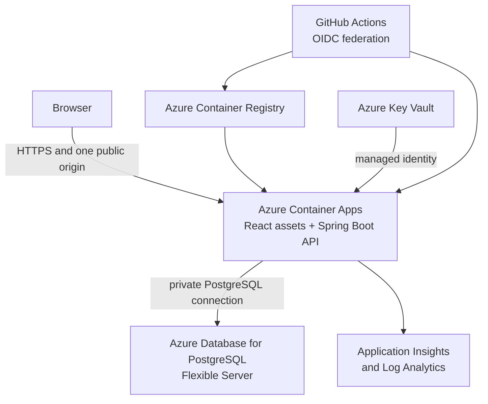

# Azure Migration Plan

Status: Planning baseline; no Azure resources approved or created

## Objective

Move Pay Period Planner from its local-first runtime to an access-controlled
Azure portfolio environment that uses synthetic data. Preserve the current
single-origin browser security model, PostgreSQL-only persistence, Flyway
migration authority, and repository verification gates.

This plan does not approve hosting personal financial data or opening
unrestricted public signup. A real-user release requires a separate privacy,
retention, deletion, incident-response, and compliance decision.

## Target Boundary

The first release should use one containerized web application that packages
the compiled Vite frontend with the Spring Boot API. Keeping one public origin
preserves relative `/api/v1` requests, `HttpOnly` `SameSite=Strict` session
cookies, CSRF protection, and a narrow CORS policy. The backend filesystem can
remain ephemeral because PostgreSQL owns all durable runtime state.

Use Azure Front Door and a Web Application Firewall only when their edge
request limits, custom-domain routing, or public exposure controls justify the
additional cost and operational surface. They are not required to prove the
first access-controlled deployment.

## Azure Resources

The infrastructure-as-code definition should own:

- one resource group per environment in a selected Azure region;
- Azure Container Registry for immutable application images;
- an Azure Container Apps environment and application;
- Azure Database for PostgreSQL Flexible Server with private connectivity;
- virtual-network, subnet, private DNS, and role-assignment resources;
- Azure Key Vault and a workload managed identity;
- Application Insights and Log Analytics with explicit retention;
- cost tags, a budget alert, and environment-specific resource names.

Start the synthetic portfolio environment with one application replica and a
low-cost PostgreSQL SKU when the measured workload permits it. Do not enable
production high availability by assumption. Select General Purpose compute,
multiple application replicas, zone redundancy, geo-redundant recovery, or
Front Door only after availability objectives and budget justify them.

## Work Areas

### 1. Architecture and ownership

- [ ] Select the Azure subscription, region, naming convention, and resource
      ownership model.
- [ ] Confirm that the first environment is synthetic and access controlled.
- [ ] Define the acceptable recovery point, recovery time, availability, log
      retention, and monthly budget.
- [ ] Record the implemented Azure boundary in a new ADR before deployment.
- [ ] Define resource shutdown and deletion responsibilities.

Estimated effort: 1-2 engineering days.

### 2. Application container

- [ ] Add a multi-stage container build for the Vite frontend and Java 21
      Spring Boot backend.
- [ ] Package the compiled frontend with the backend so UI and API share one
      public origin.
- [ ] Run the final image as a non-root user with an ephemeral filesystem.
- [ ] Use `/actuator/health` for startup, readiness, and liveness checks.
- [ ] Verify secure cookies, forwarded HTTPS headers, static-route fallback,
      request identifiers, and maximum request size behind Azure ingress.

Estimated effort: 2-4 engineering days.

### 3. Infrastructure as code

- [ ] Select Bicep or Terraform and make it the provisioning authority.
- [ ] Define development and portfolio environments without copying secrets
      into source control or infrastructure outputs.
- [ ] Configure private database access and deny broad public database access.
- [ ] Configure managed identity and least-privilege Azure role assignments.
- [ ] Add cost tags, budget alerts, and a documented teardown command.

Estimated effort: 4-7 engineering days.

### 4. PostgreSQL and Flyway

- [ ] Create separate database identities for Flyway migrations and runtime
      queries and writes. The runtime role must not own the schema.
- [ ] Require encrypted PostgreSQL connections and use private DNS/networking.
- [ ] Keep Flyway as the only schema authority and validate the complete
      migration chain against an empty database.
- [ ] Validate each release against the previous released schema.
- [ ] Run migrations as a controlled deployment step or Container Apps job
      before shifting traffic, rather than relying on concurrent replicas.
- [ ] Preserve additive, backward-compatible migrations so the previous
      application revision remains a viable rollback target.

Estimated effort: 3-5 engineering days.

### 5. Secrets and configuration

- [ ] Store production-only values in Key Vault and expose them through managed
      identity or Container Apps secret references.
- [ ] Generate unique database and operator credentials; never reuse local
      defaults.
- [ ] Enable the Spring `prod` profile, secure session cookies, and an explicit
      allowed origin.
- [ ] Document secret rotation without printing credential values.

Estimated effort: 2-3 engineering days.

### 6. Delivery and rollback

- [ ] Extend GitHub Actions only after the target environment is approved.
- [ ] Authenticate to Azure with workload identity federation and GitHub OIDC,
      not a long-lived service-principal secret.
- [ ] Run the existing verification and security gates before building an
      immutable image.
- [ ] Scan, publish, and deploy the image by digest.
- [ ] Gate traffic promotion on migration success, health, and an authenticated
      synthetic smoke test.
- [ ] Retain and prove rollback to the previous compatible revision.
- [ ] Require an environment approval before production deployment.

Estimated effort: 3-5 engineering days.

### 7. Observability and incident response

- [ ] Export sanitized backend logs and Java telemetry to Application Insights
      and Log Analytics without financial payloads, credentials, cookies, or
      session tokens.
- [ ] Preserve `X-Request-ID` correlation from browser failures through backend
      completion events.
- [ ] Add dashboards for request rate, latency, errors, JVM health, container
      health, database saturation, snapshot saves, and restores.
- [ ] Alert on unhealthy revisions, elevated server errors, authentication
      failure spikes, resource saturation, storage growth, and backup failures.
- [ ] Document the first-response and escalation procedure.

Estimated effort: 3-5 engineering days.

### 8. Backup and recovery

- [ ] Select PostgreSQL backup retention and redundancy when provisioning the
      server.
- [ ] Prove application JSON export and version-checked restore using synthetic
      data.
- [ ] Prove point-in-time restore into a separate PostgreSQL server.
- [ ] Verify accounts, workspace ownership, current records, snapshot versions,
      audit history, Flyway history, login, and application startup after the
      restore.
- [ ] Document the connection switch, post-restore configuration, and cleanup.

Estimated effort: 2-4 engineering days.

### 9. Demo access and lifecycle

- [ ] Disable unrestricted public signup or replace it with a synthetic demo
      access flow.
- [ ] Ensure reviewers never see another reviewer's modified workspace.
- [ ] Implement isolated, expiring demo accounts or a repeatable synthetic
      reset with safe concurrency behavior.
- [ ] Provide an operator procedure for access revocation and environment
      shutdown.

Estimated effort: 2-4 engineering days.

### 10. Hosted verification and documentation

- [ ] Run hosted health, signup/sign-in, CSRF, workspace isolation, save,
      optimistic-concurrency, export, restore, accessibility, and responsive
      checks with synthetic data.
- [ ] Exercise database unavailability, failed migration, unhealthy revision,
      rollback, and restore paths.
- [ ] Add deployment, recovery, incident, secret-rotation, cost, and shutdown
      runbooks.
- [ ] Update the architecture map only after Azure becomes the current runtime.
- [ ] Report hosted and production-only checks as passed, failed, or skipped;
      do not infer them from local verification.

Estimated effort: 5-8 engineering days across verification and documentation.

## Delivery Milestones

### Milestone A: Deployable artifact

The repository builds one hardened container, serves the frontend and API from
one origin, and passes the current local and hosted verification gates.

### Milestone B: Non-production Azure environment

Infrastructure as code provisions an access-controlled environment with
private PostgreSQL, managed secrets, health checks, cost controls, and
sanitized telemetry. Deployment remains synthetic-only.

### Milestone C: Repeatable delivery and recovery

GitHub OIDC deploys an immutable image through controlled Flyway migrations,
hosted smoke checks, and a proved rollback. Application-level and
database-level restores have both been demonstrated.

### Milestone D: Portfolio release

The public entry point uses HTTPS, prevents cross-reviewer data exposure,
enforces an approved access policy, has basic alerts and operating runbooks,
and stays within the approved budget.

## Effort Range

For one engineer familiar with the repository:

| Outcome                        | Expected effort         |
| ------------------------------ | ----------------------- |
| Basic private synthetic demo   | 15-25 engineering days  |
| Polished public portfolio demo | 25-40 engineering days  |
| Real-user production service   | 40-60+ engineering days |

The real-user estimate excludes open-ended legal or compliance review and
ongoing operations. Work areas can overlap, so a polished portfolio release
is approximately four to six calendar weeks when pursued as the primary work.

## Completion Gate

The Azure portfolio migration is complete only when:

1. infrastructure is reproducible from reviewed source;
2. the application and database communicate through the approved private
   boundary;
3. unique secrets and least-privilege identities are in use;
4. Flyway migration, health verification, and rollback are proved;
5. sanitized telemetry and actionable alerts are active;
6. application and point-in-time restores are proved on separate targets;
7. demo access cannot expose one visitor's changes to another;
8. hosted security, browser, accessibility, and responsive checks have recorded
   results; and
9. privacy, retention, cost, incident, and shutdown boundaries are documented.
