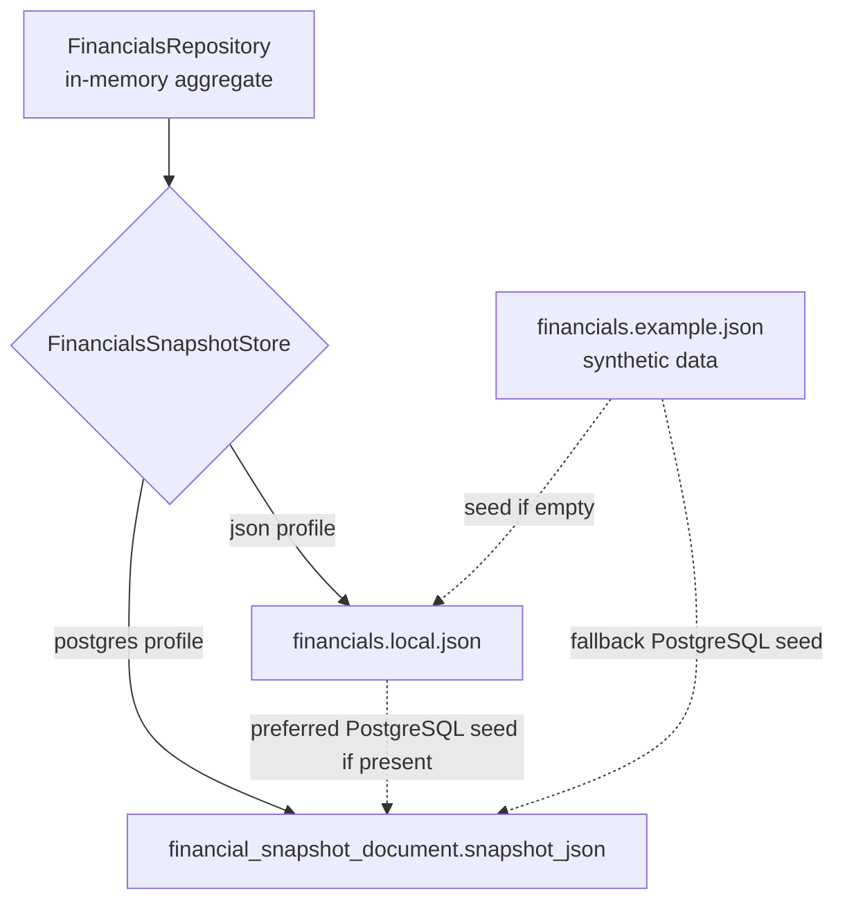

# Database Ownership and Storage Guide

## Storage Model

The backend owns one `FinancialsData` aggregate. A profile-specific
`FinancialsSnapshotStore` serializes that aggregate to one of two local storage
targets:



The two adapters store the same source fields:

- Pay-period start and end anchors
- Monthly bills
- Annual withdrawals
- Asset accounts with category keys and labels
- Debt accounts
- Income summary source items
- Income events
- Important dates

Derived API totals, due dates, period flags, monthly check counts, UI statuses,
and projection values are not stored.

## Ownership

| Concern                             | Owner                                           |
| ----------------------------------- | ----------------------------------------------- |
| Aggregate shape                     | `repository/FinancialsData.java`                |
| In-memory records and ID assignment | `repository/FinancialsRepository.java`          |
| Adapter contract                    | `repository/FinancialsSnapshotStore.java`       |
| JSON load/save/recovery copy        | `JsonFinancialsSnapshotStore.java`              |
| PostgreSQL load/save/version update | `PostgresFinancialsSnapshotStore.java`          |
| Profile selection                   | `application*.properties` and Spring `@Profile` |
| Schema history                      | Ordered files under `db/migration/`             |
| Local role/database creation        | `scripts/setup-local-postgres.ps1`              |
| Read-only role creation             | `scripts/setup-postgres-readonly-role.ps1`      |
| Read-only diagnosis                 | `scripts/inspect-postgres.ps1`                  |
| Personal-data custody               | The local developer/operator                    |

Controllers and services must not read files or issue SQL. Storage adapters
must not calculate API totals or presentation fields.

## JSON Profile

The default `json` profile disables datasource and Flyway auto-configuration.

| Path                                     | Purpose                | Source-control policy         |
| ---------------------------------------- | ---------------------- | ----------------------------- |
| `backend/data/financials.example.json`   | Synthetic seed         | Committed                     |
| `backend/data/financials.local.json`     | Active local snapshot  | Ignored; may be personal      |
| `backend/data/financials.local.json.tmp` | In-progress write      | Never commit                  |
| `backend/data/financials.local.json.bak` | Previous snapshot copy | Never commit; may be personal |

Load behavior:

1. Use `financials.local.json` when it exists.
2. Otherwise copy `financials.example.json`.
3. If neither exists, write an empty aggregate.

Save behavior:

1. Serialize the complete aggregate to the sibling `.tmp` file.
2. Copy the current local file to `.bak` when present.
3. Atomically replace the local file when the filesystem supports it.
4. Fall back to a normal replacement move otherwise.

The `.bak` file is one local recovery copy, not a durable backup strategy.

## PostgreSQL Profile

Activate with `SPRING_PROFILES_ACTIVE=postgres`.

| Variable            | Local default                                    | Purpose                  |
| ------------------- | ------------------------------------------------ | ------------------------ |
| `DATABASE_URL`      | `jdbc:postgresql://localhost:5432/financial_app` | JDBC target              |
| `DATABASE_USERNAME` | `financial_app_user`                             | Runtime application role |
| `DATABASE_PASSWORD` | Local development password                       | Runtime credential       |

Do not reuse local default credentials outside an isolated development
environment.

### Active document table

`financial_snapshot_document` is the active persistence table:

| Column          | Meaning                                      |
| --------------- | -------------------------------------------- |
| `id`            | Database identity                            |
| `active`        | Marks the current document                   |
| `version`       | Increments on every successful update        |
| `snapshot_json` | Complete `FinancialsData` aggregate as JSONB |
| `created_at`    | Row creation timestamp                       |
| `updated_at`    | Latest update timestamp                      |

A partial unique index allows at most one row where `active = true`. The store
loads the first active row, updates every active row in one statement, and
inserts version 1 when no active row exists. Version is storage metadata and is
not exposed as an optimistic-concurrency token.

### Empty-database seed order

When no active document exists:

1. Read `financials.local.json` if present.
2. Otherwise read `financials.example.json` if present.
3. Otherwise create an empty aggregate.
4. Insert that aggregate as the version 1 active document.

Starting the PostgreSQL profile can therefore copy personal local JSON into the
database. Never treat first startup as a read-only operation.

### Normalized V1 tables

V1 creates:

- `financial_snapshot`
- `monthly_withdrawal`
- `annual_withdrawal`
- `asset_account`
- `debt_account`
- `income_summary_item`
- `income_event`
- `important_date`

These tables are inactive relational groundwork. The current application does
not read or write them, so zero rows is expected even when the document table
contains an active snapshot. Do not dual-write or backfill them without a new
architectural decision, migration plan, and parity tests.

## PostgreSQL Roles

### Administrator

The local PostgreSQL administrator creates roles/databases, changes ownership,
and performs recovery. The backend must never run with this role. Its password
must not be stored in the repository or environment files.

### Application role

`financial_app_user` owns the local `financial_app` database and is
write-capable. It needs:

- Database connection
- Schema usage
- Flyway/schema creation privileges
- Select, insert, and update on the active document table
- Sequence privileges needed for identity IDs

The setup script currently grants database ownership and broad local
privileges. This is convenient for development, not a production privilege
model.

### Read-only inspection role

Use a separate login for MCP servers, reporting, or tools that do not need to
save. Create or update the local read-only role with:

```powershell
.\scripts\setup-postgres-readonly-role.ps1
```

The script prompts for the PostgreSQL administrator password and the
read-only-role password, then:

1. Creates or updates `financial_app_reader`.
2. Grants database `CONNECT`.
3. Grants `USAGE` on `public`.
4. Grants `SELECT` on existing public tables.
5. Grants default `SELECT` privileges for future tables created by
   `financial_app_user`.
6. Sets the role's default transaction mode to read-only for `financial_app`.
7. Verifies the role cannot create database/schema objects or write public
   tables.

Manual equivalent SQL:

```sql
GRANT CONNECT ON DATABASE financial_app TO financial_app_reader;
GRANT USAGE ON SCHEMA public TO financial_app_reader;
GRANT SELECT ON ALL TABLES IN SCHEMA public TO financial_app_reader;

ALTER DEFAULT PRIVILEGES FOR ROLE financial_app_user IN SCHEMA public
GRANT SELECT ON TABLES TO financial_app_reader;
```

Create and password the login through secure administrator tooling; do not put
its password in this repository. Validate the result with:

```sql
BEGIN TRANSACTION READ ONLY;
SELECT current_user, current_database(),
       current_setting('transaction_read_only');
ROLLBACK;
```

Read-only tooling must not receive `CREATE`, `INSERT`, `UPDATE`, `DELETE`,
`TRUNCATE`, sequence mutation, or function-execution privileges beyond what it
explicitly needs.

Use `financial_app_reader` for PostgreSQL MCP servers. Use
`financial_app_user` only for the Spring Boot application runtime and local
schema setup.

## Migrations

- Add a new versioned migration for every schema change.
- Never edit a migration that may have been applied.
- Keep migration SQL deterministic and compatible with the supported
  PostgreSQL version.
- Add constraints and indexes with the table change they protect.
- Test migrations on an isolated database/schema before using personal data.
- Document data transformations, recovery, and compatibility with both stores.

The `postgres` runtime enables Flyway. The current local setup script also
applies V1/V2 SQL directly when representative tables are absent. Direct setup
does not create Flyway history, so `flyway_schema_history` may be absent in a
locally initialized database. This dual path is a known development limitation;
do not infer migration history solely from table presence, and establish one
migration authority before production use.

## Safe Operations

| Operation                       | Mutates data?                  | Preferred command                                |
| ------------------------------- | ------------------------------ | ------------------------------------------------ |
| Check tools/configuration       | No                             | `scripts/check-environment.ps1 -IncludePostgres` |
| Inspect schema/counts/metadata  | No                             | `scripts/inspect-postgres.ps1`                   |
| Create role/database/schema     | Yes                            | `scripts/setup-local-postgres.ps1`               |
| Start PostgreSQL-backed backend | Potentially; seeds if empty    | `scripts/start-backend-postgres.ps1`             |
| Run isolated store smoke test   | Yes, isolated test schema only | `scripts/verify-local.ps1 -IncludePostgres`      |

Investigation uses explicit read-only transactions. Do not run setup,
migrations, `ANALYZE`, DDL, DML, or destructive recovery merely to diagnose a
problem.

## Backup, Restore, and Migration

There is no automated PostgreSQL backup or cross-profile migration command.

- Before risky JSON changes, copy both `.local.json` and `.bak` to a protected
  location outside the repository.
- Before PostgreSQL changes, use administrator-approved database-native backup
  tooling and verify restoration on a separate target.
- Treat backups and exports as personal financial data.
- Do not overwrite either profile implicitly to “synchronize” them.
- When deliberately moving JSON data into an empty PostgreSQL database, verify
  the source file, take backups, start the profile once, and inspect only
  metadata/counts afterward.
- A rollback must restore the aggregate and its metadata consistently; do not
  copy only selected JSON keys or normalized tables.

## Failure and Recovery Boundaries

- JSON parse/write failures become a generic persistence failure at the API
  boundary; inspect local paths and recovery copies without printing values.
- PostgreSQL serialization/query failures become the same generic API failure;
  inspect connectivity, schema, active-row count, version, and privileges.
- Multiple active document rows violate the intended invariant and require
  administrator-led recovery after a backup.
- An empty document table is healthy before first PostgreSQL-backed startup.
- Empty normalized V1 tables are healthy under the current adapter.

See `docs/api-contract.md` for request replacement semantics and
`docs/domain-glossary.md` for storage terminology.
