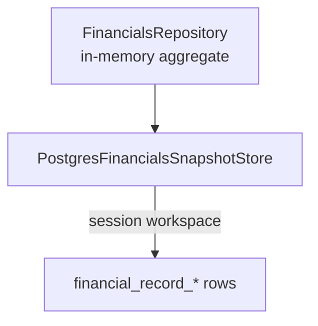

# Database Ownership and Storage Guide

## Storage Model

The backend owns one `domain/financials/FinancialSnapshot` aggregate. A
request-scoped `PostgresFinancialsSnapshotStore` loads current state and audit
history through separate workspace-scoped queries and persists versioned
aggregate replacements in PostgreSQL.

This guide describes current executable storage behavior. ADR 0014 records the
implemented PostgreSQL-only target.



The relational adapter stores these source fields:

- Pay-period start and end anchors
- Pay cadence and IANA planning time zone
- Monthly bills
- Annual withdrawals
- Asset accounts with category keys and labels
- Debt accounts
- Income summary source items
- Income events
- Important dates
- Audit events for committed changes, including version movement and coarse
  aggregate projection summaries

Current API response totals, due dates, period flags, monthly check counts, and
UI statuses are derived on read and are not stored as current snapshot fields.
Historical audit events do store compact aggregate projection summaries for
the version created by each committed write.

## Ownership

| Concern                              | Owner                                         |
| ------------------------------------ | --------------------------------------------- |
| Domain aggregate and records         | `domain/financials/`                          |
| In-memory records and ID assignment  | `repository/FinancialsRepository.java`        |
| Adapter contract                     | `repository/FinancialsSnapshotStore.java`     |
| Current/history/replacement boundary | `PostgresFinancialsSnapshotStore.java`        |
| Relational record adapter path       | `PostgresFinancialRecordSnapshotAdapter.java` |
| Runtime configuration                | `application.properties`                      |
| Schema history                       | Ordered files under `db/migration/`           |
| Local role/database creation         | `scripts/setup-local-postgres.ps1`            |
| Local migration execution            | `scripts/migrate-postgres.ps1`                |
| Read-only role creation              | `scripts/setup-postgres-readonly-role.ps1`    |
| Read-only diagnosis                  | `scripts/inspect-postgres.ps1`                |
| Personal-data custody                | The local developer/operator                  |

Controllers and services must not read files or issue SQL. Storage adapters
must not calculate API totals or presentation fields.

## Obsolete Local Files

`backend/data/financials.local.json` and its `.tmp`/`.bak` siblings are ignored
obsolete personal-data artifacts. The runtime and supported operator workflows
never read or write them. Delete them only with explicit owner approval.
`backend/data/financials.example.json` remains committed synthetic input for
tests, browser workflows, and portfolio captures only.

## PostgreSQL Runtime

| Variable            | Local default                                    | Purpose                  |
| ------------------- | ------------------------------------------------ | ------------------------ |
| `DATABASE_URL`      | `jdbc:postgresql://localhost:5432/financial_app` | JDBC target              |
| `DATABASE_USERNAME` | `financial_app_user`                             | Runtime application role |
| `DATABASE_PASSWORD` | Local development password                       | Runtime credential       |

Do not reuse local default credentials outside an isolated development
environment.

### Retired transition storage

V2 historically created `financial_snapshot_document`, and V7 added
`financial_snapshot_workspace_migration` plus an optional source linkage.
ADR 0028 records the explicit decision to waive recovery from those obsolete
stores. V10 drops both tables and removes the linkage. V11 removes unowned
compatibility rows and makes relational workspace ownership non-null.

### Empty-workspace behavior

Starting the application never copies local JSON or synthetic example data.
Signup creates identity and membership rows only. A financial request for
a workspace without an explicitly created relational snapshot
returns `404`. The browser can create a version-1 relational snapshot with
zero-value projection input records by posting its selected pay-period dates
to `/api/v1/financials`; V8 stores their typed role references and V9 stores
their planning cadence and time zone with the snapshot. The unique active
workspace constraint rejects duplicate and concurrent initialization.

### Retired normalized V1 schema

V1 creates:

- `financial_snapshot`
- `monthly_withdrawal`
- `annual_withdrawal`
- `asset_account`
- `debt_account`
- `income_summary_item`
- `income_event`
- `important_date`

These tables never became the active relational persistence path. ADR 0029 and
V12 remove them after explicit owner approval to discard obsolete application
storage. Their creation remains visible only in immutable Flyway history; do
not recreate, query, or repair through them.

### Workspace-owned relational runtime path

V3 creates the `financial_record_*` table family:

- `financial_record_snapshot`
- `financial_record_monthly_bill`
- `financial_record_annual_withdrawal`
- `financial_record_asset_account`
- `financial_record_debt_account`
- `financial_record_income_summary_item`
- `financial_record_income_event`
- `financial_record_important_date`

These tables are the clean relational path from ADR 0010. They store the
backend `FinancialSnapshot` domain aggregate as relational records while
preserving the application record IDs as `app_record_id`.

V4 adds unique `(snapshot_id, app_record_id)` indexes to each record table so
stable application IDs remain unambiguous within a relational snapshot. ADR
0016 later retired the record-level CRUD methods, but the additive constraints
and applied migration remain part of the schema history.

V6 adds `workspace_id` ownership to `financial_record_snapshot`, replaces the
global active-snapshot index with one active snapshot per workspace, and makes
every `PostgresFinancialRecordSnapshotAdapter` load and replacement require a
workspace ID. Child records inherit that ownership through their snapshot
foreign key.

V8 adds `financial_record_projection_role`. Each versioned snapshot stores the
application record ID selected for the rent bill, rent-reserve asset account,
and primary-paycheck income-summary item. V8 backfills exact historical anchor
labels; the service completes an older backup without roles before it is persisted.
Typed reference integrity is validated by the application because one role
table cannot use a direct foreign key to three different child-table types.

V9 adds `pay_cadence` and `planning_time_zone` to
`financial_record_snapshot`. Supported cadence values are constrained to
`WEEKLY`, `BIWEEKLY`, `SEMIMONTHLY`, and `MONTHLY`; the application validates
the time-zone value as an IANA zone. Existing rows default to `BIWEEKLY` and
`UTC`. Both fields are versioned, copied through backup/restore, and replaced
with the rest of the aggregate.

V6 introduced workspace ownership without assigning preexisting relational
rows. V11 completes that transition: it removes any remaining unowned rows,
drops the transitional index and check constraint, and makes `workspace_id`
`NOT NULL`. Every retained runtime snapshot therefore has explicit workspace
ownership.

The adapter saves and loads one active relational snapshot per workspace and
marks only that workspace's previous relational snapshots inactive. The
runtime `PostgresFinancialsSnapshotStore` resolves the authenticated membership
and uses this adapter for aggregate operations. Writes lock the stable
workspace row, verify the expected version, insert the next active snapshot,
and retain prior rows as history.

### V5 identity, workspace, and session runtime foundation

V5 creates the ownership and authentication schema needed by ADR 0014:

- `application_user` stores a case-insensitively unique normalized email,
  password hash, display name, status, and timestamps. Plaintext passwords are
  never stored.
- `workspace` identifies a future ownership boundary and records its creating
  user.
- `workspace_membership` assigns `owner`, `admin`, or `member` roles and
  permits at most one owner per workspace.
- `application_session` stores a server-generated session ID and token hash,
  expiration, last-seen, and revocation timestamps. Plaintext session tokens
  are never stored.

Foreign keys, unique indexes, and check constraints enforce the initial
identity model independently of application code. Signup creates a user, a
`Personal` workspace, an owner membership, and a hashed opaque session in one
transaction. Sign-in verifies Spring Security's adaptive password hash,
recovery reloads current memberships from PostgreSQL, and sign-out revokes the
session. The browser cookie is `HttpOnly` and `SameSite=Strict`; production
configuration requires its `Secure` flag.
State-changing account requests also require the CSRF cookie/header pair
bootstrapped by `GET /api/v1/auth/csrf`.

The PostgreSQL financial runtime requires these account sessions. It resolves
the sole membership automatically or validates `X-Workspace-ID` for
multi-workspace accounts, and state-changing financial requests require the
same CSRF cookie/header proof. Zero rows in the four V5 tables remains expected
before the account API is used.

### V7 relational audit persistence

V7 adds `financial_record_audit_event`. Audit rows belong to a relational
snapshot and retain application event IDs, timestamps, version movement,
coarse action/resource metadata, and projection summaries. They do not contain
request bodies or field-level diffs. Runtime writes append exactly one new
relational audit event while history reads span retained snapshots for the
selected workspace. The request repository loads current snapshot records
lazily and does not load them for a history-only request. History is queried
newest first with the validated limit applied in SQL.

V7 also introduced temporary migration-history infrastructure. V10 removes
that ledger, the V2 JSONB document table, and source-document linkage after the
owner chose independent re-entry instead of preserving obsolete local data.

Whole-snapshot replacement still creates a new immutable relational snapshot.
The adapter batches each child-record family in groups of up to 100 and inserts
the new audit event in the same workspace-locked transaction. It does not pass
or rewrite the complete historical event list on an ordinary runtime save.

## PostgreSQL Roles

### Administrator

The local PostgreSQL administrator creates roles/databases, changes ownership,
and performs recovery. The backend must never run with this role. Its password
must not be stored in the repository or environment files.

### Application role

`financial_app_user` owns the local `financial_app` database and is
write-capable. It needs:

- Database connection
- Schema usage
- Flyway/schema creation privileges
- Select, insert, update, and delete on identity, workspace, relational
  snapshot, record, and audit tables
- Sequence privileges needed for identity IDs

The setup script currently grants database ownership and broad local
privileges. This is convenient for development, not a production privilege
model.

### Read-only inspection role

Use a separate login for MCP servers, reporting, or tools that do not need to
save. Create or update the local read-only role with:

```powershell
.\scripts\setup-postgres-readonly-role.ps1
```

The script prompts for the PostgreSQL administrator password and the
read-only-role password, then:

1. Creates or updates `financial_app_reader`.
2. Grants database `CONNECT`.
3. Grants `USAGE` on `public`.
4. Grants `SELECT` on existing public tables.
5. Grants default `SELECT` privileges for future tables created by
   `financial_app_user`.
6. Sets the role's default transaction mode to read-only for `financial_app`.
7. Verifies the role cannot create database/schema objects or write public
   tables.

Manual equivalent SQL:

```sql
GRANT CONNECT ON DATABASE financial_app TO financial_app_reader;
GRANT USAGE ON SCHEMA public TO financial_app_reader;
GRANT SELECT ON ALL TABLES IN SCHEMA public TO financial_app_reader;

ALTER DEFAULT PRIVILEGES FOR ROLE financial_app_user IN SCHEMA public
GRANT SELECT ON TABLES TO financial_app_reader;
```

Create and password the login through secure administrator tooling; do not put
its password in this repository. Validate the result with:

```sql
BEGIN TRANSACTION READ ONLY;
SELECT current_user, current_database(),
       current_setting('transaction_read_only');
ROLLBACK;
```

Read-only tooling must not receive `CREATE`, `INSERT`, `UPDATE`, `DELETE`,
`TRUNCATE`, sequence mutation, or function-execution privileges beyond what it
explicitly needs.

Use `financial_app_reader` for PostgreSQL MCP servers. Use
`financial_app_user` only for the Spring Boot application runtime and local
schema setup.

## Migrations

- Add a new versioned migration for every schema change.
- Never edit a migration that may have been applied.
- Keep migration SQL deterministic and compatible with the supported
  PostgreSQL version.
- Add constraints and indexes with the table change they protect, or as a
  separate additive migration when the table may already exist.
- Test migrations on an isolated database/schema before using personal data.
- Document data transformations, destructive retirement, and recovery limits.

Flyway is the single migration authority. The `postgres` runtime and
`scripts/migrate-postgres.ps1` use the same ordered migration directory and
validate the resulting history. `scripts/setup-local-postgres.ps1` creates the
role and database, verifies that Flyway owns any existing application schema,
and delegates all versioned DDL to the migration script. Do not execute
versioned files directly with `psql -f`.

A non-empty database without `flyway_schema_history` fails setup. Legacy
baseline switches were retired with ADR 0029 after obsolete-store recovery was
waived. Back up and inspect such a database, then plan an explicit additive
recovery on a copy or replace it when the database is disposable. Never
fabricate Flyway history.

## Safe Operations

| Operation                                 | Mutates data?                                         | Preferred command                                |
| ----------------------------------------- | ----------------------------------------------------- | ------------------------------------------------ |
| Check tools/configuration                 | No                                                    | `scripts/check-environment.ps1 -IncludePostgres` |
| Inspect schema/counts/metadata            | No                                                    | `scripts/inspect-postgres.ps1`                   |
| Create role/database and migrate          | Yes                                                   | `scripts/setup-local-postgres.ps1`               |
| Run pending migrations/validation         | Yes                                                   | `scripts/migrate-postgres.ps1`                   |
| Start backend                             | No financial seeding; sessions may write through APIs | `scripts/start-backend.ps1`                      |
| Run required PostgreSQL integration tests | Yes, isolated test schemas only                       | `scripts/verify-local.ps1`                       |

Investigation uses explicit read-only transactions. Do not run setup,
migrations, `ANALYZE`, DDL, DML, or destructive recovery merely to diagnose a
problem.

## Backup and Restore

The application exposes a manual snapshot export:

```http
GET /api/v1/financials/export
```

The export is a JSON attachment whose `snapshot` field mirrors the
full-snapshot save request shape. It is useful as a portable, source-shaped
copy of the currently saved aggregate. Application backups do not include
complete relational audit history, which remains in relational storage.

The backend exposes one explicit application-level restore endpoint:

```http
POST /api/v1/financials/restore?expectedVersion=<current-version>
```

The JSON restore is not a merge. It accepts the export envelope unchanged and
replaces the complete aggregate through the same validation and optimistic
replacement path as `PUT /api/v1/financials`. The embedded snapshot version is
source metadata; the separate `expectedVersion` must match the current target
workspace. This permits deliberate recovery from an older backup while a
concurrent target write still fails with `409 Conflict`.

Application restore is useful for deliberate local recovery from a trusted
export, but it is not an automated backup schedule, PostgreSQL dump, or
complete audit-history backup. The PowerShell
export/restore helpers sign in with
`FINANCIALS_ACCOUNT_EMAIL` and `FINANCIALS_ACCOUNT_PASSWORD`, require
`-WorkspaceId` when the account has multiple memberships, and revoke their
temporary server session afterward.

- Before PostgreSQL changes, use administrator-approved database-native backup
  tooling and verify restoration on a separate target.
- Treat backups, exports, and restore files as personal financial data.
- Treat audit history as personal financial data because aggregate totals and
  timestamps can reveal financial behavior.
- Do not commit downloaded exports or store them in repository folders. The
  export script refuses repository output paths unless explicitly overridden for
  synthetic/mock data.
- A rollback must restore the aggregate and its metadata consistently; do not
  copy only selected JSON keys or normalized tables.

## Failure and Recovery Boundaries

- Backup JSON parse failures become a generic API failure; inspect the trusted
  export without printing values.
- PostgreSQL serialization/query failures become the same generic API failure;
  inspect connectivity, schema, active-row count, version, and privileges.
- Multiple active relational snapshot rows for one workspace violate the
  intended invariant and require administrator-led recovery after a backup.
- V1 tables are absent after V12; their presence means the database has not
  completed the current Flyway chain.
- Empty workspace-owned `financial_record_*` tables are healthy only for
  workspaces that have not initialized a snapshot.

See `docs/api-contract.md` for request replacement semantics and
`docs/domain-glossary.md` for storage terminology.
