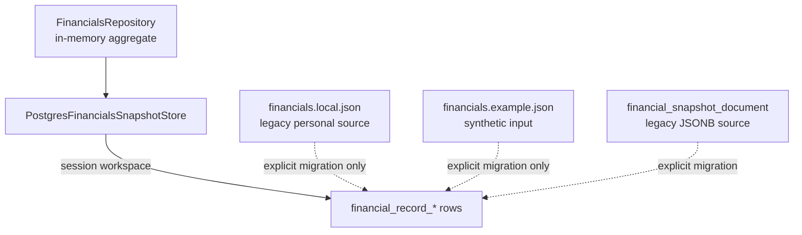

# Database Ownership and Storage Guide

## Storage Model

The backend owns one `domain/financials/FinancialSnapshot` aggregate. A
request-scoped `PostgresFinancialsSnapshotStore` persists the repository
`FinancialsData` storage envelope in one authenticated relational workspace.

This guide describes current executable storage behavior. ADR 0014 records the
implemented PostgreSQL-only target.



The relational adapter stores these source fields:

- Pay-period start and end anchors
- Monthly bills
- Annual withdrawals
- Asset accounts with category keys and labels
- Debt accounts
- Income summary source items
- Income events
- Important dates
- Audit events for committed changes, including version movement and coarse
  aggregate projection summaries

Current API response totals, due dates, period flags, monthly check counts, and
UI statuses are derived on read and are not stored as current snapshot fields.
Historical audit events do store compact aggregate projection summaries for
the version created by each committed write.

## Ownership

| Concern                             | Owner                                           |
| ----------------------------------- | ----------------------------------------------- |
| Domain aggregate and records        | `domain/financials/`                            |
| Storage envelope                    | `repository/FinancialsData.java`                |
| In-memory records and ID assignment | `repository/FinancialsRepository.java`          |
| Adapter contract                    | `repository/FinancialsSnapshotStore.java`       |
| PostgreSQL load/save/version update | `PostgresFinancialsSnapshotStore.java`          |
| Relational record adapter path      | `PostgresFinancialRecordSnapshotAdapter.java`   |
| Workspace migration orchestration   | `WorkspaceSnapshotMigrationService.java`        |
| Migration metadata/audit storage    | `PostgresWorkspaceSnapshotMigrationRepository.java` |
| Runtime configuration               | `application.properties`                        |
| Schema history                      | Ordered files under `db/migration/`             |
| Local role/database creation        | `scripts/setup-local-postgres.ps1`              |
| Local migration execution           | `scripts/migrate-postgres.ps1`                  |
| Read-only role creation             | `scripts/setup-postgres-readonly-role.ps1`      |
| Read-only diagnosis                 | `scripts/inspect-postgres.ps1`                  |
| Personal-data custody               | The local developer/operator                    |

Controllers and services must not read files or issue SQL. Storage adapters
must not calculate API totals or presentation fields.

## Legacy JSON Files

`backend/data/financials.local.json` and its `.tmp`/`.bak` siblings are ignored
legacy personal-data artifacts. The runtime never reads or writes them.
Preserve them until their owner has completed an explicit backup and workspace
migration. `backend/data/financials.example.json` remains committed synthetic
input for tests, demos, and intentional migration only.

## PostgreSQL Runtime

| Variable            | Local default                                    | Purpose                  |
| ------------------- | ------------------------------------------------ | ------------------------ |
| `DATABASE_URL`      | `jdbc:postgresql://localhost:5432/financial_app` | JDBC target              |
| `DATABASE_USERNAME` | `financial_app_user`                             | Runtime application role |
| `DATABASE_PASSWORD` | Local development password                       | Runtime credential       |

Do not reuse local default credentials outside an isolated development
environment.

### Legacy document table

`financial_snapshot_document` is retained as a legacy migration source:

| Column          | Meaning                                                                      |
| --------------- | ---------------------------------------------------------------------------- |
| `id`            | Database identity                                                            |
| `active`        | Marks the current document                                                   |
| `version`       | Current optimistic-concurrency version                                       |
| `snapshot_json` | Complete `FinancialsData` storage envelope as JSONB, including audit history |
| `created_at`    | Row creation timestamp                                                       |
| `updated_at`    | Latest update timestamp                                                      |

A partial unique index allows at most one legacy row where `active = true`.
Runtime requests do not read, seed, or update this table. Operator migration
endpoints may back it up and copy it into an owned relational workspace without
changing the source.

### Empty-workspace behavior

Starting the application never copies local JSON or synthetic example data.
Signup creates identity and membership rows only. A financial request for
a workspace without an explicitly migrated or created relational snapshot
returns `404`.

### Normalized V1 tables

V1 creates:

- `financial_snapshot`
- `monthly_withdrawal`
- `annual_withdrawal`
- `asset_account`
- `debt_account`
- `income_summary_item`
- `income_event`
- `important_date`

These tables are inactive historical groundwork. ADR 0009 decides they should
not become the active relational persistence path as-is. The current
application does not read or write them, so zero rows is expected even when the
document table contains an active snapshot.

Do not dual-write, backfill, query, or repair through the V1 tables.

### V3/V4/V6 relational runtime path

V3 creates the `financial_record_*` table family:

- `financial_record_snapshot`
- `financial_record_monthly_bill`
- `financial_record_annual_withdrawal`
- `financial_record_asset_account`
- `financial_record_debt_account`
- `financial_record_income_summary_item`
- `financial_record_income_event`
- `financial_record_important_date`

These tables are the clean relational path from ADR 0010. They store the
backend `FinancialSnapshot` domain aggregate as relational records while
preserving the application record IDs as `app_record_id`.

V4 adds unique `(snapshot_id, app_record_id)` indexes to each record table so
granular updates and deletes can target one domain record unambiguously within
the active relational snapshot.

V6 adds `workspace_id` ownership to `financial_record_snapshot`, replaces the
global active-snapshot index with one active snapshot per workspace, and makes
every `PostgresFinancialRecordSnapshotAdapter` load, replacement, find,
create, update, and delete operation require a workspace ID. Child records
inherit that ownership through their snapshot foreign key.

V6 does not silently assign any preexisting relational snapshot to a user or
workspace. Its workspace-required check is `NOT VALID`: PostgreSQL enforces it
for every new or changed row while a legacy unowned row can remain untouched
for the explicit migration workflow. A transitional unique index still allows
at most one active unowned row. After explicit ownership migration, a later
migration must validate the check and remove that transitional index.

The adapter saves and loads one active relational snapshot per workspace,
marks only that workspace's previous relational snapshots inactive, and can
perform workspace-scoped record-level CRUD. The runtime
`PostgresFinancialsSnapshotStore` resolves the authenticated membership and
uses this adapter for every aggregate and granular API operation. Writes lock
the stable workspace row, verify the expected version, insert the next active
snapshot, and retain prior rows as history.

### V5 identity, workspace, and session runtime foundation

V5 creates the ownership and authentication schema needed by ADR 0014:

- `application_user` stores a case-insensitively unique normalized email,
  password hash, display name, status, and timestamps. Plaintext passwords are
  never stored.
- `workspace` identifies a future ownership boundary and records its creating
  user.
- `workspace_membership` assigns `owner`, `admin`, or `member` roles and
  permits at most one owner per workspace.
- `application_session` stores a server-generated session ID and token hash,
  expiration, last-seen, and revocation timestamps. Plaintext session tokens
  are never stored.

Foreign keys, unique indexes, and check constraints enforce the initial
identity model independently of application code. Signup creates a user, a
`Personal` workspace, an owner membership, and a hashed opaque session in one
transaction. Sign-in verifies Spring Security's adaptive password hash,
recovery reloads current memberships from PostgreSQL, and sign-out revokes the
session. The browser cookie is `HttpOnly` and `SameSite=Strict`; production
configuration requires its `Secure` flag.
State-changing account requests also require the CSRF cookie/header pair
bootstrapped by `GET /api/v1/auth/csrf`.

The PostgreSQL financial runtime requires these account sessions. It resolves
the sole membership automatically or validates `X-Workspace-ID` for
multi-workspace accounts, and state-changing financial requests require the
same CSRF cookie/header proof. Zero rows in the four V5 tables remains expected
before the account API is used.

### V7 migration history and relational audit preservation

V7 adds `financial_record_audit_event` so an explicit workspace migration can
preserve the audit history carried by the legacy `FinancialsData` JSON
envelope. Audit rows belong to a relational snapshot and retain application
event IDs, timestamps, version movement, coarse action/resource metadata, and
projection summaries. They do not contain request bodies or field-level diffs.

V7 also adds `financial_snapshot_workspace_migration`. Each row records the
source kind and SHA-256 fingerprint, effective source version, optional source
document ID, named destination owner/workspace, migrated snapshot ID, record
and audit counts, applied/rolled-back status, and timestamps. It does not store
another copy of the financial snapshot. Database constraints require an actual
workspace membership and allow at most one applied migration per workspace.

The PostgreSQL-only operator service uses this schema to migrate either an
explicit JSON file or the active legacy JSONB document into an empty workspace.
It validates source fidelity, preserves audit history, verifies counts and
version inside the transaction, and leaves the source untouched. Runtime writes
append new relational audit events while history reads span retained snapshots
for the selected workspace.

## PostgreSQL Roles

### Administrator

The local PostgreSQL administrator creates roles/databases, changes ownership,
and performs recovery. The backend must never run with this role. Its password
must not be stored in the repository or environment files.

### Application role

`financial_app_user` owns the local `financial_app` database and is
write-capable. It needs:

- Database connection
- Schema usage
- Flyway/schema creation privileges
- Select, insert, update, and delete on identity, workspace, relational
  snapshot, record, audit, and migration tables
- Sequence privileges needed for identity IDs

The setup script currently grants database ownership and broad local
privileges. This is convenient for development, not a production privilege
model.

### Read-only inspection role

Use a separate login for MCP servers, reporting, or tools that do not need to
save. Create or update the local read-only role with:

```powershell
.\scripts\setup-postgres-readonly-role.ps1
```

The script prompts for the PostgreSQL administrator password and the
read-only-role password, then:

1. Creates or updates `financial_app_reader`.
2. Grants database `CONNECT`.
3. Grants `USAGE` on `public`.
4. Grants `SELECT` on existing public tables.
5. Grants default `SELECT` privileges for future tables created by
   `financial_app_user`.
6. Sets the role's default transaction mode to read-only for `financial_app`.
7. Verifies the role cannot create database/schema objects or write public
   tables.

Manual equivalent SQL:

```sql
GRANT CONNECT ON DATABASE financial_app TO financial_app_reader;
GRANT USAGE ON SCHEMA public TO financial_app_reader;
GRANT SELECT ON ALL TABLES IN SCHEMA public TO financial_app_reader;

ALTER DEFAULT PRIVILEGES FOR ROLE financial_app_user IN SCHEMA public
GRANT SELECT ON TABLES TO financial_app_reader;
```

Create and password the login through secure administrator tooling; do not put
its password in this repository. Validate the result with:

```sql
BEGIN TRANSACTION READ ONLY;
SELECT current_user, current_database(),
       current_setting('transaction_read_only');
ROLLBACK;
```

Read-only tooling must not receive `CREATE`, `INSERT`, `UPDATE`, `DELETE`,
`TRUNCATE`, sequence mutation, or function-execution privileges beyond what it
explicitly needs.

Use `financial_app_reader` for PostgreSQL MCP servers. Use
`financial_app_user` only for the Spring Boot application runtime and local
schema setup.

## Migrations

- Add a new versioned migration for every schema change.
- Never edit a migration that may have been applied.
- Keep migration SQL deterministic and compatible with the supported
  PostgreSQL version.
- Add constraints and indexes with the table change they protect, or as a
  separate additive migration when the table may already exist.
- Test migrations on an isolated database/schema before using personal data.
- Document data transformations, recovery, and compatibility with both stores.

Flyway is the single migration authority. The `postgres` runtime and
`scripts/migrate-postgres.ps1` use the same ordered migration directory and
validate the resulting history. `scripts/setup-local-postgres.ps1` creates the
role and database, inspects legacy state, and delegates all versioned DDL to the
migration script. Do not execute versioned files directly with `psql -f`.

A non-empty database without `flyway_schema_history` fails setup by default.
After a backup and read-only inspection, use
`-AdoptLegacySnapshotDocumentSchema` only for a V2 document-only schema with
the expected columns and no duplicate active rows. Flyway V2 restores the
unique-active index when it is absent. Use `-AdoptLegacyV4Schema` only when the
expected V1-V4 table/index signature is present. The setup script checks that
object signature before creating a baseline. It refuses empty, partial,
mismatched, or mixed schemas.

## Safe Operations

| Operation                           | Mutates data?                   | Preferred command                                |
| ----------------------------------- | ------------------------------- | ------------------------------------------------ |
| Check tools/configuration           | No                              | `scripts/check-environment.ps1 -IncludePostgres` |
| Inspect schema/counts/metadata      | No                              | `scripts/inspect-postgres.ps1`                   |
| Create role/database and migrate    | Yes                             | `scripts/setup-local-postgres.ps1`               |
| Run pending migrations/validation   | Yes                             | `scripts/migrate-postgres.ps1`                   |
| Back up and migrate into workspace  | Yes                             | `scripts/migrate-financial-snapshot-to-workspace.ps1` |
| Roll back unchanged migration       | Yes                             | `scripts/rollback-workspace-snapshot-migration.ps1` |
| Start backend                       | No financial seeding; sessions may write through APIs | `scripts/start-backend.ps1`          |
| Run required PostgreSQL integration tests | Yes, isolated test schemas only | `scripts/verify-local.ps1`                       |

Investigation uses explicit read-only transactions. Do not run setup,
migrations, `ANALYZE`, DDL, DML, or destructive recovery merely to diagnose a
problem.

## Backup, Restore, and Migration

The application exposes a manual snapshot export:

```http
GET /api/v1/financials/export
GET /api/v1/financials/export/csv
GET /api/v1/financials/export/xlsx
```

The export is a JSON attachment whose `snapshot` field mirrors the
full-snapshot save request shape. It is useful as a portable, source-shaped
copy of the currently saved aggregate. CSV and XLSX exports use a fixed-column
tabular representation of the same source records. These source-shaped exports
do not currently include audit history; relational storage and some retained
legacy migration sources may include it.

The backend also exposes explicit full-snapshot tabular restore endpoints:

```http
POST /api/v1/financials/import/csv
POST /api/v1/financials/import/xlsx
```

Those imports are restore operations, not merges. They replace the complete
aggregate through the same version-checked path as `PUT /api/v1/financials`.
They are useful for deliberate local recovery from a trusted export, but they
are not an automated backup schedule, PostgreSQL dump, or workspace-migration
strategy. The PowerShell export/import helpers sign in with
`FINANCIALS_ACCOUNT_EMAIL` and `FINANCIALS_ACCOUNT_PASSWORD`, require
`-WorkspaceId` when the account has multiple memberships, and revoke their
temporary server session afterward.

- Before migrating legacy JSON, copy the source and any `.bak` recovery file to
  a protected location outside the repository.
- Before PostgreSQL changes, use administrator-approved database-native backup
  tooling and verify restoration on a separate target.
- Treat backups, exports, and import files as personal financial data.
- Treat audit history as personal financial data because aggregate totals and
  timestamps can reveal financial behavior.
- Do not commit downloaded exports or store them in repository folders. The
  export script refuses repository output paths unless explicitly overridden for
  synthetic/mock data.
- Do not overwrite a legacy source while trying to synchronize it with the
  relational workspace.
- Use the supported workspace migration command for JSON/JSONB transition; do
  not rely on first-start seeding as migration evidence.
- A rollback must restore the aggregate and its metadata consistently; do not
  copy only selected JSON keys or normalized tables.

### Explicit workspace migration prerequisites

Before migration:

1. Apply Flyway through `scripts/migrate-postgres.ps1` and run the backend.
2. Create or sign in to the destination account and obtain the `Personal`
   workspace ID from the account session response.
3. Confirm that the named account is the workspace owner and the destination
   has no active relational snapshot. The command also checks both conditions
   inside its transaction and refuses overwrite.
4. Choose a protected backup path outside the repository. The backup contains
   personal financial data and audit history.
5. Stop writes to the legacy source until migration and metadata verification
   complete.

For a local JSON source:

```powershell
.\scripts\migrate-financial-snapshot-to-workspace.ps1 `
    -Source json-file `
    -InputPath .\backend\data\financials.local.json `
    -BackupPath C:\protected-backups\financials-before-workspace-migration.json `
    -DestinationEmail owner@example.com `
    -WorkspaceId 1 `
    -ConfirmMigration
```

For the active PostgreSQL JSONB document:

```powershell
.\scripts\migrate-financial-snapshot-to-workspace.ps1 `
    -Source jsonb-document `
    -BackupPath C:\protected-backups\financials-before-workspace-migration.json `
    -DestinationEmail owner@example.com `
    -WorkspaceId 1 `
    -ConfirmMigration
```

The script refuses existing backup files unless `-Force` is explicit and
refuses repository paths unless `-AllowRepositoryPath` is explicit for
synthetic data. Non-loopback HTTP is rejected; remote targets require HTTPS.
It writes or downloads the exact backup first, computes SHA-256, applies that
fingerprint, and performs a separate metadata-only `GET` afterward. Output is
limited to IDs, source kind/version/fingerprint, destination identity, counts,
and backup location. It never prints financial values.

Keep the reported migration UUID with the external backup. Do not retire or
modify the legacy source; the relational runtime reads the migrated workspace
and keeps the source only as recovery evidence.

### Guarded migration rollback

Before any runtime edit to the migrated workspace, an unchanged applied
migration can be rolled back:

```powershell
.\scripts\rollback-workspace-snapshot-migration.ps1 `
    -MigrationId <uuid> `
    -ConfirmRollback
```

Rollback checks the migration status, migrated snapshot ID, active flag,
version, and all record/audit counts. If any changed, it returns `409` and does
nothing. A successful rollback deactivates the migrated snapshot and marks the
migration `rolled_back`; it retains the relational rows and migration history
for investigation and leaves the legacy source and external backup untouched.
It does not automatically change Spring profiles or restore a modified runtime.

## Failure and Recovery Boundaries

- JSON parse/write failures become a generic persistence failure at the API
  boundary; inspect local paths and recovery copies without printing values.
- PostgreSQL serialization/query failures become the same generic API failure;
  inspect connectivity, schema, active-row count, version, and privileges.
- Multiple active relational snapshot rows for one workspace violate the
  intended invariant and require administrator-led recovery after a backup.
- An empty legacy document table is healthy.
- Empty normalized V1 tables are healthy under the current adapter.
- Empty V3/V4/V6/V7 `financial_record_*` tables are healthy only for workspaces
  that have not received an explicit initial or migrated snapshot.

See `docs/api-contract.md` for request replacement semantics and
`docs/domain-glossary.md` for storage terminology.
