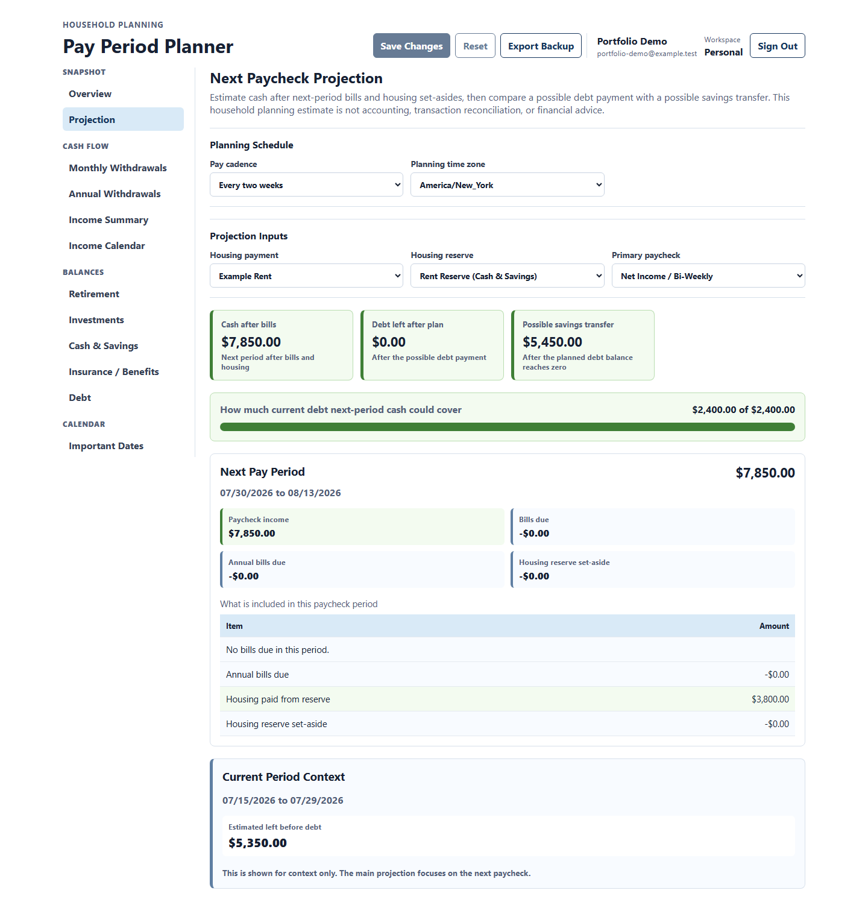
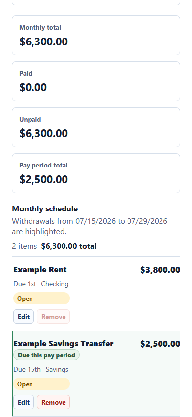
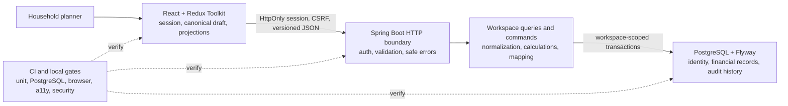

# Pay Period Planner Portfolio Case Study

Pay Period Planner turns household income, recurring bills, savings, debt, and
important dates into a versioned plan for the next pay period. This case study
explains the product workflow and the engineering transition from a local JSON
prototype to authenticated PostgreSQL workspaces.

Every screenshot below is generated from
`backend/data/financials.example.json`, a synthetic account under
`example.test`, and an isolated PostgreSQL schema that is removed immediately
after capture. No personal financial data is used.

The fixture models an established senior technical household with strong
income, retirement, brokerage, and cash-reserve balances. Its values are
illustrative product inputs, not a statement about the developer's finances or
financial advice.

## Product Walkthrough

### 1. Understand the household snapshot

The overview brings the next-pay-period estimate, balances, cash flow, and
calendar context into one scan. Workflow shortcuts lead to the underlying
records without turning the dashboard into a second editing surface.


### 2. Explain the next-paycheck estimate

The projection names its inputs instead of inferring them from display labels.
Users can select the pay cadence, planning time zone, housing payment, housing
reserve, and primary paycheck records. The result separates cash after bills,
possible debt payment, and possible savings transfer while explicitly framing
them as planning estimates.



### 3. Keep planning usable on a phone

At compact widths, grouped sidebar navigation becomes one section selector,
account controls wrap without overlap, and financial tables reflow into labeled
rows without page-level or contained horizontal scrolling.



## Architecture



The browser edits one canonical draft and submits the complete financial
workspace with its expected version. The backend resolves the current account
and workspace from database membership, validates and normalizes the aggregate,
performs the replacement under a workspace lock, and appends a coarse audit
event. PostgreSQL relational tables are the sole runtime store. V10 removes the
obsolete JSONB transition table and migration administration after the owner
confirmed that the original data remained independently available. V11 removes
unowned compatibility rows and requires every remaining snapshot to belong to
a workspace.

## STAR Story

### Situation

The first working version solved a real planning problem with a React frontend,
a Spring Boot API, and one local JSON snapshot. That made iteration fast, but
the application had two startup modes, global data ownership, Basic
authentication, file-write recovery concerns, and no safe path for multiple
users. Continuing to add features on both JSON and PostgreSQL paths would have
multiplied complexity and weakened the portfolio story.

### Task

Evolve the prototype into one coherent, scalable application without losing
the useful pay-period workflow or silently moving personal data. The target
needed one runtime database, account and workspace isolation, stale-write
protection, an explicit decision about obsolete personal data, and verification
that cross-layer behavior still matched the snapshot contract.

### Action

1. Recorded the target architecture and transition rules in ADRs before
   changing runtime ownership.
2. Established Flyway as the only migration authority and added account,
   workspace, membership, session, relational financial-record, projection-role,
   planning-setting, and audit tables through additive migrations.
3. Replaced browser Basic authentication with signup, sign-in, session
   recovery, sign-out, CSRF protection, and database-derived workspace access.
4. Activated one relational, workspace-scoped snapshot store with optimistic
   versions, batched replacement writes, and separately limited audit queries.
5. Built a guarded JSON/JSONB migration workflow while data ownership was
   uncertain, then retired the workflow, transition tables, and inactive V1
   schema through V10-V12 once the owner chose independent re-entry from the
   original spreadsheet.
6. Removed the JSON runtime profile, duplicate startup instructions, granular
   mutation APIs, and extra import/export formats after the replacement paths
   were verified.
7. Added unit, controller, isolated PostgreSQL, live browser, accessibility,
   responsive, dependency, and static-analysis gates around the surviving
   architecture.

### Result

The application now has one PostgreSQL startup path and one version-checked
financial mutation boundary. Account sessions and workspace membership isolate
users, stale clients receive `409 Conflict` instead of overwriting newer work,
and obsolete personal data is neither seeded nor carried as permanent
compatibility infrastructure. The codebase is smaller in responsibility despite
supporting more real behavior, and the architecture can be explained from user
workflow through database transaction and verification evidence.

The current limitation is equally explicit: this is a local-first portfolio
application, not yet a production deployment. Provider selection, managed
backups, edge request limits, telemetry export, and demo reset policy remain
deployment work rather than hidden claims.

## Reproduce the Evidence

From the repository root:

```powershell
.\scripts\capture-portfolio-evidence.ps1
```

Add `-InstallBrowsers` on a workstation that does not yet have Playwright
Chromium. The command uses ports `18081` and `3001` by default, writes the three
PNG files under `docs/images/portfolio`, and removes its isolated schema even
when capture fails. Use only the committed synthetic fixture when publishing
or refreshing these images.

## Supporting Evidence

- [Architecture map](architecture-map.md)
- [API contract](api-contract.md)
- [Known limitations](known-limitations.md)
- [Production-readiness roadmap](production-readiness-roadmap.md)
- [Engineering evidence](engineering-evidence.md)
- [Verification matrix](verification-matrix.md)
- [Architecture decision records](adr/README.md)
