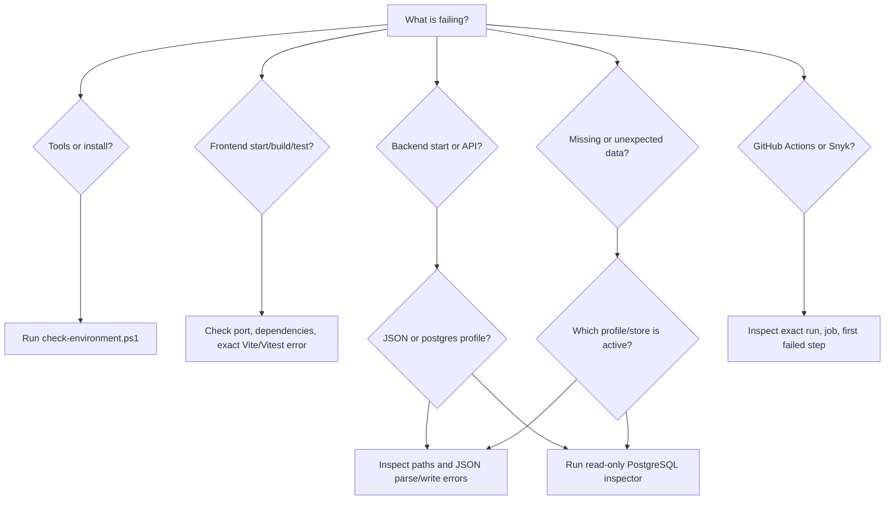

# Troubleshooting Decision Tree

Start with the symptom, not a guessed fix. Preserve personal data and capture
the first actionable error before changing configuration or rerunning setup.



## Safety Rules

Before troubleshooting:

- Do not delete, reseed, overwrite, normalize by hand, or migrate personal
  financial data.
- Do not paste full JSON snapshots, database rows, credentials, or Snyk tokens
  into issues, logs, prompts, or chat.
- Prefer status codes, exception types, paths, schema presence, row counts,
  versions, timestamps, and JSON keys/types.
- Back up local JSON and PostgreSQL before any approved repair.
- Treat `setup-local-postgres.ps1`, PostgreSQL-backed startup, and migration
  commands as mutating.

If data appears lost, stop normal save/startup experiments and follow
[Suspected data loss](#suspected-data-loss).

## 1. Environment or Bootstrap Failure

Run from the repository root:

```powershell
.\scripts\check-environment.ps1
```

Add `-IncludePostgres` only when preparing the PostgreSQL profile.

### A tool is missing or the wrong version

1. Use the exact missing-tool message from the script.
2. Verify `JAVA_HOME` points to a JDK, not only a JRE.
3. Verify the terminal’s `java`, `javac`, `node`, `npm`, and `git` resolve to
   the expected installations.
4. For PostgreSQL, the script checks both `PATH` and standard Windows install
   directories.
5. Install or change machine-wide configuration only with explicit operator
   approval.

### Dependency installation fails

1. Preserve the first npm/Maven registry error.
2. Distinguish network/DNS/proxy failure from lockfile or package resolution.
3. Confirm the command is running from the repository root.
4. Retry only when evidence indicates a transient registry/network failure.
5. Do not replace `npm ci` with an unlocked install to hide lockfile drift.

### PowerShell blocks scripts

Confirm the failure is execution-policy related. Do not broadly lower machine
policy. Follow the scoped user-level guidance in the README only when the
operator approves it.

## 2. Frontend Failure

### Development server will not start

1. Run `npm --prefix frontend run dev` and capture the first error.
2. If port `3000` is occupied, identify the owning process:

   ```powershell
   Get-NetTCPConnection -LocalPort 3000 -ErrorAction SilentlyContinue
   ```

3. Do not kill an unknown process without operator approval.
4. If a package cannot be resolved, run bootstrap rather than manually
   installing an unrecorded dependency.
5. If the UI starts but API calls fail, continue to
   [Frontend loads but data does not](#frontend-loads-but-data-does-not).

### Tests/build fail with a spawn permission error

This can be an execution sandbox blocking Vite’s helper process rather than a
code failure.

1. Confirm typecheck/lint results separately.
2. Retry the exact command in a trusted normal terminal or an approved
   less-restricted execution context.
3. Do not modify Vite configuration merely to bypass an environment policy.
4. If the command still fails outside the restriction, diagnose it as a real
   tooling/configuration failure.

### Coverage threshold fails

1. Read the per-file and aggregate coverage output.
2. Confirm new behavior has an assertion that fails without the change.
3. Add focused tests for uncovered behavior.
4. Do not lower thresholds or add broad exclusions as a repair.

### Frontend loads but data does not

1. Confirm the backend is listening on port `8080`.
2. Verify the browser request path begins with `/api`; Vite proxies that prefix.
3. Inspect the response status without sharing its body:

   ```powershell
   (Invoke-WebRequest http://localhost:8080/api/v1/financials).StatusCode
   ```

4. For `400`, inspect Problem Detail field names/messages.
5. For `500` with `Persistence failure`, follow the active storage profile
   branch below.
6. For connection refusal, start or diagnose the backend.

### Save fails or draft looks stale

1. Preserve the browser draft; do not reload before capturing the error.
2. Check whether the response is validation (`400`), missing granular ID
   (`404`), or persistence (`500`).
3. Compare request field names with `docs/api-contract.md`.
4. Remember that a full snapshot save replaces every collection.
5. If another tab/client may have saved, treat it as a last-write-wins conflict;
   there is no concurrency token.

## 3. Backend Startup or API Failure

### Backend will not start

1. Confirm Java/Maven with `check-environment.ps1`.
2. Identify the active profile from startup logs.
3. Check port `8080`:

   ```powershell
   Get-NetTCPConnection -LocalPort 8080 -ErrorAction SilentlyContinue
   ```

4. Follow the JSON or PostgreSQL branch based on the active profile.
5. Do not enable the other profile as a “fix”; the stores are independent.

### JSON profile fails

Common signals include inability to load/write the configured data path or
invalid JSON.

1. Confirm `backend/data/financials.local.json` exists or can be created.
2. Inspect file existence, permissions, size, and parse error location without
   printing values.
3. Check for sibling `.tmp` and `.bak` files.
4. Back up all three before repair.
5. Never replace an existing local file with example data automatically.
6. Restore from `.bak` only after explicit approval and after preserving the
   current file for investigation.

### API returns `400 Invalid request`

1. Read the `errors` array in the Problem Detail response.
2. Check required lists, strings that must not be blank, dates, due-day/month/day ranges,
   nonnegative amounts, and positive check numbers.
3. Confirm pay-period end is on or after start.
4. Correct the client/request; do not weaken validation without a contract
   change.

### API returns `500 Persistence failure`

1. Use backend logs to identify JSON versus PostgreSQL and the exception type.
2. Do not expose the full exception if it embeds a personal-data path/value.
3. For JSON, follow the JSON branch above.
4. For PostgreSQL, follow the inspector branch below.

## 4. PostgreSQL Failure

Begin with the read-only baseline:

```powershell
.\scripts\inspect-postgres.ps1
```

It checks connectivity, transaction mode, expected tables, exact counts, active
snapshot metadata, Flyway history when present, and effective privileges.

### `psql.exe` is missing

Run `check-environment.ps1 -IncludePostgres`. Add PostgreSQL’s `bin` directory
to `PATH` or use the installed full path only after confirming the installation
version. Do not rerun database setup to solve an executable-path problem.

### Password authentication fails

1. Confirm the intended host, port, database, and username.
2. Confirm whether environment variables override local defaults.
3. Never print the password.
4. An administrator may reset the application-role password after explicit
   approval; then restart the backend with matching credentials.

### Database does not exist

Setup has not completed for that target. Confirm the target name before running
the mutating setup script:

```powershell
.\scripts\setup-local-postgres.ps1
```

Do not run setup against an unknown/shared server.

### Expected table does not exist

1. Inspect all expected table-presence results and Flyway history.
2. Compare ordered migration files with the target.
3. Do not edit an applied migration or manually create only the missing table.
4. On a disposable empty local database, rerun approved setup.
5. On a database containing personal data, back up and plan an additive repair
   migration.

### Tables exist but Flyway history is absent

This can result from the current local setup script applying V1/V2 directly.
It is registered as `LIM-014`.

1. Do not fabricate history rows.
2. Do not assume the runtime can safely apply future migrations.
3. Before adding migrations, establish one migration authority and test an
   upgrade path on a copy/disposable target.

### `financial_snapshot_document` has zero rows

This is expected before first PostgreSQL-backed startup. Starting the backend
will seed it from personal local JSON when present, then mock example data, then
an empty snapshot. Confirm and back up the intended source before startup.

### Normalized tables are empty

Expected. They are inactive V1 groundwork. The active data is the JSONB
document row. Do not backfill normalized tables as a troubleshooting step.

### More than one active document or unexpected version changes

1. Stop writers.
2. Back up the database.
3. Capture IDs, active flags, versions, and timestamps only.
4. Escalate for administrator-led recovery; do not choose/delete a row
   heuristically.

### Permission failure

1. Use inspector privilege output to identify the denied capability.
2. Confirm whether the caller should be the write-capable app role or a
   read-only inspection role.
3. Grant only the missing intended privilege through an administrator.
4. Never make an MCP/reporting role the database owner.

## 5. Missing or Unexpected Data

### Confirm the active store

- No explicit profile means JSON.
- `SPRING_PROFILES_ACTIVE=postgres` means PostgreSQL.
- The stores do not synchronize automatically.

Data “missing” after switching profiles usually means the other store is being
read, not that records were deleted.

### Suspected data loss

1. Stop the backend and avoid saves.
2. Record the active profile and last known good time.
3. Preserve:
   - Current `.local.json`, `.tmp`, and `.bak` files, or
   - A PostgreSQL administrator-approved backup.
4. Collect metadata only: file timestamps/sizes or document ID, active flag,
   version, and timestamps.
5. Compare with the last known backup outside the live target.
6. Plan restoration or migration explicitly; never merge snapshots by guessing
   which missing collections are intentional.

### Data changed after read

The service can normalize missing name-based anchors (`Rent`, `Rent Reserve`,
and `Net Income` / `Bi-Weekly`) in responses. A later full save can persist
them. Check `docs/domain-glossary.md` and `LIM-007` before treating those records
as corruption.

## 6. Local Verification Failure

1. Identify the first named step that failed.
2. Run that exact command directly for a focused log.
3. Classify it as code, prerequisite, sandbox, database, credential, network,
   or external-service failure.
4. Fix the verified cause and rerun the focused command.
5. Rerun `verify-local.ps1` before completion.
6. Add `-IncludePostgres` only when the change requires it; the option mutates
   and drops its isolated test schema.

Generated coverage/build changes are test artifacts. Do not commit them unless
the repository intentionally tracks and the task updates them.

## 7. GitHub Actions Failure

1. Identify repository, commit SHA, run attempt, event, job, and first failing
   step.
2. Inspect annotations and the relevant log window.
3. Treat downstream skipped/cancelled jobs as consequences when their `needs`
   failed.
4. Reproduce with the exact workflow command.
5. Distinguish code/test, runner/tooling, workflow, permission/secret,
   dependency/security, and external-service failures.
6. Retry only failures shown to be transient.
7. After a fix is pushed, inspect the new run; do not infer hosted success from
   local checks.

Use `$triage-github-ci` for the repository-specific workflow.

## 8. Snyk Failure

### Missing CLI or token

This is an unavailable check, not a clean scan. Install/authenticate only
through approved tooling; never print `SNYK_TOKEN`.

### Scan finds vulnerabilities

1. Record manifest/project, vulnerable package and installed version,
   introduced-through path, severity/advisory, and fixed version.
2. Prefer upgrading the owning direct dependency.
3. Check breaking changes and both lock files.
4. Use overrides only with compatibility evidence.
5. If no fix exists, document reachability, controls, and explicit risk
   acceptance; do not silently ignore it.
6. Rerun local verification and the authenticated hosted scan.

### Scan times out, rate-limits, or service is unavailable

Classify it as external-service failure. Preserve the service error, retry only
when appropriate, and keep the security gate pending.

## Escalation Bundle

When handing a problem to another person or agent, include:

- Current branch/commit and relevant changed files
- Operating system and tool versions
- Exact command and first actionable error
- Active Spring profile
- HTTP status and redacted Problem Detail
- PostgreSQL database/user names, schema presence, row counts, versions, and
  privileges—never passwords or snapshot values
- Checks attempted and whether they mutated anything
- Backup status
- Relevant known-limitation ID

See `docs/verification-matrix.md`, `docs/database-storage-guide.md`, and
`docs/known-limitations.md` for deeper policy.
